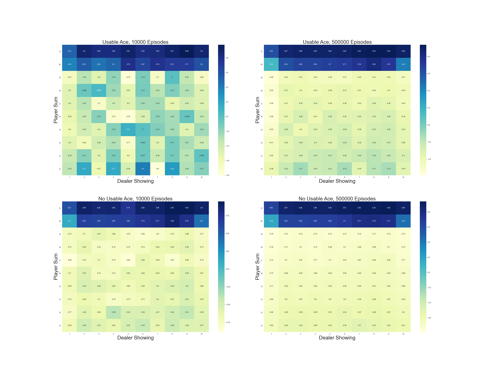
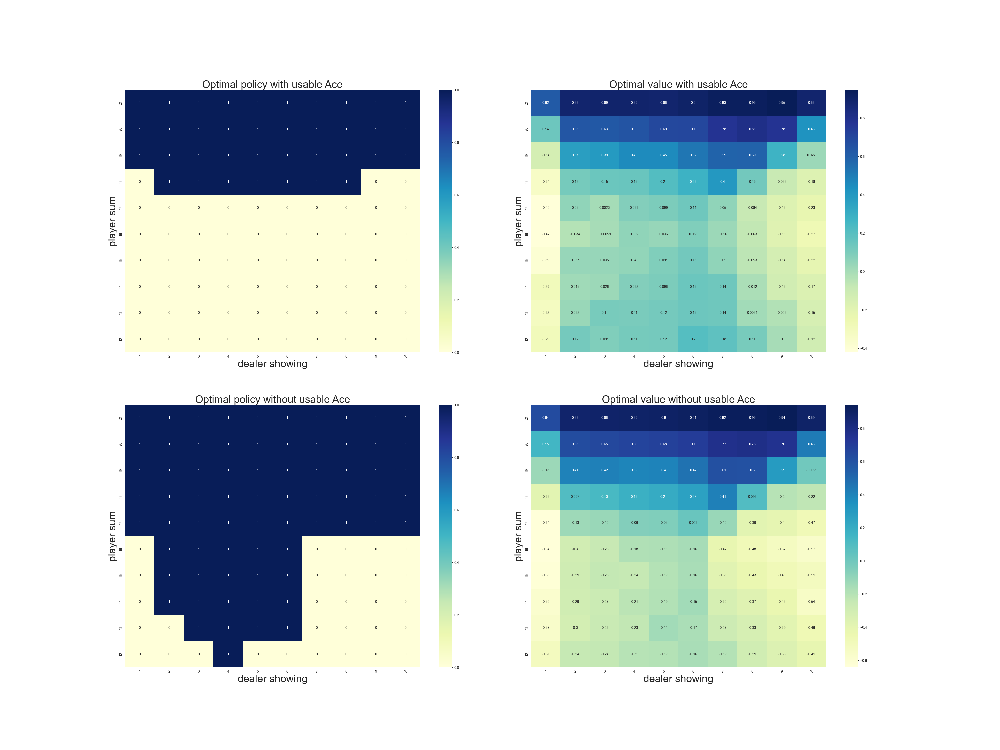
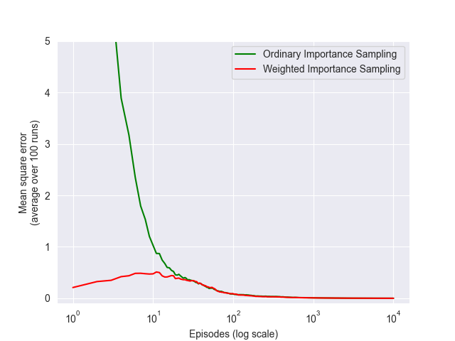

# Blackjack Monte Carlo Methods - Interactive Visualization

This project implements and visualizes Monte Carlo methods for solving the game of Blackjack, following exercises and examples from Chapter 5 of "Reinforcement Learning: An Introduction" by Sutton and Barto (2nd Edition).

The project features an **interactive React-based visualization** that allows real-time exploration of Monte Carlo algorithms in action, complementing the original Python implementation with an engaging educational tool.

## Features

We cover:
* **On-Policy First-Visit Monte Carlo** for value function estimation
* **Monte Carlo Exploring Starts (MC-ES)** for finding the optimal policy
* **Off-Policy Evaluation** using importance sampling with ordinary and weighted estimators
* **Interactive Visualization** with real-time algorithm execution and state value display

### Project Structure

The project consists of two main components:

#### Python Implementation (`black_jack.py`)
- **Game Setup** 
  * Definitions for cards, player and dealer actions, and policies
  * Constants for hit/stick actions and policy arrays

- **Core Gameplay**
  * `play()` simulates a full round of Blackjack with trajectory tracking
  * `get_card()`, `card_value()`, `update_cards()` handle card mechanics

- **Policies**
  * `target_policy_player()` — fixed strategy for the player (hit < 17, stick ≥ 17)
  * `behavior_off_policy_player()` — random behavior for off-policy sampling

- **Monte Carlo Algorithms**
  * `monte_carlo_on_policy()` — estimates value function under the player's policy
  * `monte_carlo_es()` — learns optimal policy via Exploring Starts
  * `monte_carlo_off_policy()` — evaluates a fixed policy with importance sampling

#### Interactive Visualization (React Component)
- **Real-time Monte Carlo Simulation**
  * Choose between different Monte Carlo methods
  * Adjustable episode count (100-10,000)
  * Live progress tracking and statistics

- **State Value Function Display**
  * Interactive grid showing estimated values for each state
  * Color-coded visualization (green for positive, red for negative returns)
  * Separate display for usable/non-usable ace states

- **Game Analytics**
  * Win/loss/draw statistics for recent games
  * State visitation tracking
  * Recent game history with detailed outcomes

### Game Rules and State Representation

**Blackjack Rules:**
- **Objective:** Get closer to 21 than dealer without going over
- **Card Values:** Ace = 1 or 11, Face cards = 10, Number cards = face value
- **Player Policy:** Hit if sum < 17, stick if sum ≥ 17
- **Dealer Policy:** Hit if sum < 17, stick if sum ≥ 17

**State Representation:**
Each state is defined by a tuple: `(usable_ace, player_sum, dealer_showing_card)`
- `usable_ace`: Boolean indicating if player has an ace counted as 11
- `player_sum`: Total value of player's cards (12-21)
- `dealer_showing_card`: Dealer's visible card (1-10)

### Interactive Features

#### Algorithm Selection
- **On-Policy Monte Carlo:** Uses target policy to generate episodes and estimate state values
- **Monte Carlo Exploring Starts:** Learns optimal policy through random state initialization
- **Off-Policy Monte Carlo:** Evaluates target policy using behavior policy data

#### Real-Time Visualization
- **Value Function Grid:** 10×10 grid showing state values for different player sums and dealer cards
- **Color Coding:** Immediate visual feedback on state quality
- **Progress Tracking:** Live updates of episode count and convergence
- **Statistics Dashboard:** Win rates, state visitation, and recent game outcomes

#### Educational Benefits
- **Algorithm Comparison:** Side-by-side comparison of different Monte Carlo methods
- **Convergence Visualization:** Watch how value estimates improve with more episodes
- **Policy Understanding:** See which states favor the player vs. dealer
- **Interactive Learning:** Experiment with different parameters and observe results

### Project Results and Insights

The visualization demonstrates key concepts from reinforcement learning:

#### Value Function Convergence
- **Early Episodes:** High variance in value estimates due to limited sampling
- **Later Episodes:** Values converge to true expected returns
- **State Coverage:** Some states visited more frequently than others

#### Policy Implications
- **Positive Values (Green):** States where player has advantage
- **Negative Values (Red):** States favoring the dealer
- **Usable Ace Impact:** Shows how having a usable ace affects state values

#### Algorithm Comparison
- **On-Policy:** Direct evaluation of fixed policy
- **Exploring Starts:** Learns optimal policy through exploration
- **Off-Policy:** Evaluates one policy while following another

### Usage Instructions

#### Running the Visualization
1. Load the React component in a compatible environment
2. Select desired Monte Carlo method from dropdown
3. Adjust episode count using the slider (100-10,000)
4. Click "Start" to begin simulation
5. Observe real-time updates to the value function grid
6. Click on individual states to see detailed information

#### Interpreting Results
- **Green Cells:** Player has positive expected return in this state
- **Red Cells:** Player has negative expected return in this state
- **Cell Values:** Top number = with usable ace, bottom = without usable ace
- **Statistics Panel:** Shows recent performance and convergence metrics

### Educational Value

This interactive visualization serves as a powerful educational tool for understanding:
- **Monte Carlo Methods:** How sampling-based algorithms estimate value functions
- **Policy Evaluation:** The relationship between policies and state values
- **Exploration vs. Exploitation:** Trade-offs in learning optimal strategies
- **Convergence Properties:** How estimates improve with more data
- **Blackjack Strategy:** Optimal play in different game situations

The combination of theoretical implementation and interactive visualization provides a comprehensive understanding of Monte Carlo methods in reinforcement learning, making complex algorithms accessible through hands-on experimentation and real-time feedback.

### Project Results

#### Figure 5.1: Value Function Estimation - On-Policy Monte Carlo

* **Four heatmaps** showing state-value estimates under fixed policy
* **Top row**: States with usable ace (10,000 and 500,000 episodes)
* **Bottom row**: States without usable ace (10,000 and 500,000 episodes)
* **Key insight**: Value estimates converge and stabilize with more episodes; usable ace generally improves expected returns

#### Figure 5.2: Optimal Policy and Value Function - Monte Carlo Exploring Starts  

* **Left plots**: Optimal actions learned via MC-ES (blue = stick, yellow = hit)
* **Right plots**: State values under optimal policy
* **Key insight**: Optimal policy is more aggressive with usable ace; demonstrates clear improvement over fixed policy values

#### Figure 5.3: Off-Policy Evaluation - Importance Sampling Comparison

* **Comparison** of ordinary vs weighted importance sampling estimators
* **X-axis**: Episodes (log scale), **Y-axis**: Mean squared error over 100 runs
* **Key insight**: Weighted importance sampling shows dramatically lower variance and better convergence than ordinary sampling

### Technical Implementation

The project demonstrates:
- **State Space Management:** Efficient representation of Blackjack states
- **Monte Carlo Sampling:** First-visit and every-visit variants
- **Importance Sampling:** Off-policy evaluation techniques  
- **Real-time Visualization:** Responsive UI updates during algorithm execution
- **Educational Design:** Clear visual feedback and intuitive controls

This implementation bridges the gap between theoretical understanding and practical application, providing an engaging platform for exploring fundamental concepts in reinforcement learning.