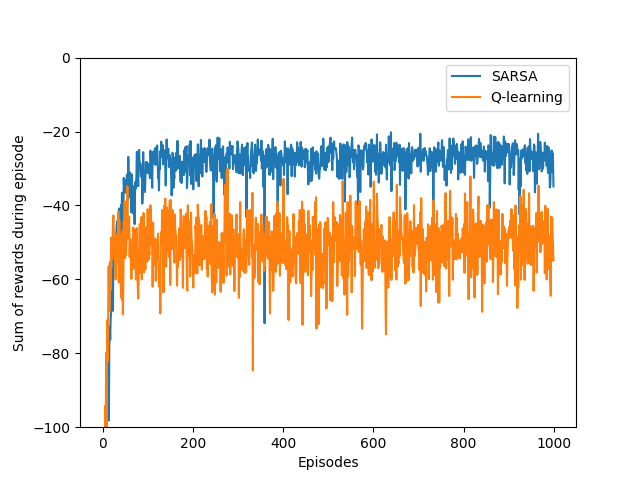
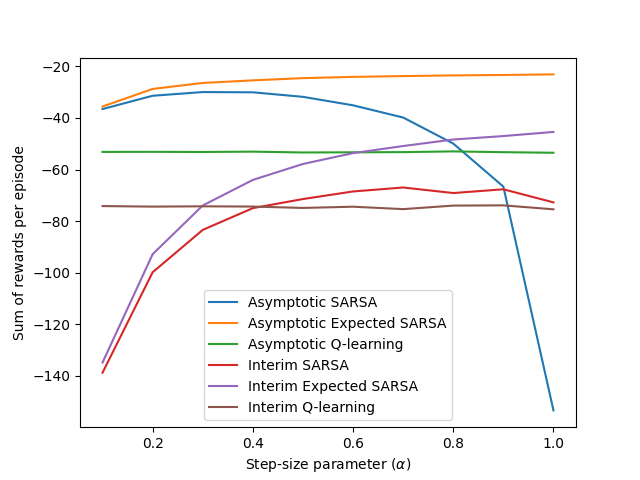

# Temporal-Difference Learning in Cliff Walking

This project implements and compares **SARSA**, **Expected SARSA**, and **Q-Learning** in the classic **Cliff Walking** gridworld environment. The implementation is based on **Example 6.6** from *Reinforcement Learning: An Introduction* by **Richard S. Sutton** and **Andrew G. Barto**.

The goal is to explore how different temporal-difference learning methods balance risk, reward, and exploration in an environment with harsh penalties, demonstrating the fundamental differences between on-policy and off-policy approaches.

## Project Structure

```
cliff-walking/
├── src/                          # Core logic for environment and learning algorithms
│   └── cliff_walking.py
├── notebooks/                    # Jupyter Notebook with experiments and visualizations  
│   └── cliff_walking.ipynb
├── book_images/                  # Reference images from the textbook
│   ├── Example_6_6_graph.PNG
│   ├── Example_6_6_grid.PNG
│   └── Figure_6_3.PNG
├── generated_images/             # Output plots from simulations
│   ├── example_6_6.png
│   └── figure_6_3.png
└── README.md                     # Project documentation
```

## Environment Description

The **Cliff Walking** environment is a 4×12 gridworld where an agent must navigate from the start position (bottom-left) to the goal (bottom-right) while avoiding a treacherous cliff.

### Environment Specifications
- **Grid Size**: 4 rows × 12 columns
- **Start State**: Bottom-left corner (S)
- **Goal State**: Bottom-right corner (G)
- **The Cliff**: Bottom row between start and goal
- **Actions**: Up (↑), Down (↓), Left (←), Right (→)
- **Reward Structure**:
  - Normal transitions: -1
  - Stepping into cliff: -100 (returns agent to start)
  - Reaching goal: 0 (episode terminates)

This creates two possible strategies:
- **Risky but optimal**: Travel along the cliff edge (shortest path)
- **Safe but suboptimal**: Navigate through the upper portion of the grid

## Overview of Algorithms

This project includes implementations of three temporal-difference control methods:

### SARSA (State-Action-Reward-State-Action)
- **Type**: On-policy method
- **Update Rule**: Uses the action actually taken by the current policy
- **Behavior**: Takes exploration into account during learning
- **Result**: Learns safer, longer path to avoid cliff penalties

### Expected SARSA  
- **Type**: Hybrid approach combining on-policy and off-policy elements
- **Update Rule**: Uses expected value over all possible next actions weighted by policy probabilities
- **Behavior**: Reduces variance compared to SARSA while maintaining stability
- **Result**: Often achieves more consistent performance than standard SARSA

### Q-Learning
- **Type**: Off-policy method
- **Update Rule**: Always updates toward the maximum possible next state value
- **Behavior**: Learns optimal action values regardless of exploration policy
- **Result**: Discovers optimal (risky) policy but suffers during exploration

All methods employ **ε-greedy action selection** (ε = 0.1) for balancing exploration and exploitation.

## Visualizations

### Reference Figures
These figures are taken directly from Sutton & Barto's textbook and serve as ground truth comparisons:


*The cliff walking gridworld showing start (S), goal (G), and cliff positions*


*Learning curves comparing SARSA and Q-learning performance over episodes*


*Performance sensitivity analysis across different step-size parameters*

### Simulation Results
Plots generated from the implemented algorithms during training:


*Reproduced learning curves showing SARSA vs Q-learning episode returns*


*Step-size parameter analysis for all three algorithms (asymptotic and interim performance)*

These visualizations demonstrate the learned policies and episode returns across SARSA, Q-Learning, and Expected SARSA implementations.

## Key Findings and Analysis

### Learned Policies

**SARSA Policy (Safe Strategy)**:
```
→ → → → → → → → → ↓ → ↓
→ → ↑ ← → → → ↑ ↑ → → ↓  
↑ ↑ ↑ ↑ ↑ ↑ ↑ ↑ ↑ ↑ → ↓
↑ ↑ ↑ ↑ ↑ ↑ ↑ ↑ ↑ ↑ ↑ G
```

**Q-Learning Policy (Optimal Strategy)**:
```
↓ ↓ ↓ ↓ ↓ ↓ ↑ ↓ ↓ ↑ ↓ ↓
↓ ↓ ↓ ↓ ↓ ↓ ↓ ↓ ↓ ↓ ↓ ↓
→ → → → → → → → → → → ↓
↑ ↑ ↑ ↑ ↑ ↑ ↑ ↑ ↑ ↑ ↑ G
```

### Performance Characteristics

- **SARSA** learns a safer policy by avoiding the cliff edge, resulting in better online performance during training despite following a suboptimal path
- **Q-Learning** discovers the shortest path but suffers from cliff falls during exploration, leading to lower training rewards despite learning optimal action values
- **Expected SARSA** provides a middle ground with more stable learning than SARSA and often superior interim performance

### Convergence Behavior
- Q-learning converges to optimal action values more directly
- SARSA provides consistently better performance during the learning phase
- Both algorithms would eventually converge to the optimal policy if ε were gradually reduced to zero

## Usage Example

```python
import numpy as np
from src.cliff_walking import world, sarsa, q_learning, print_optimal_policy

# Initialize action-value estimates
sarsa_estimates = np.zeros((world["height"], world["width"], 4))
q_learning_estimates = np.zeros((world["height"], world["width"], 4))

# Run training episodes
for episode in range(1000):
    sarsa_reward = sarsa(sarsa_estimates)
    q_learning_reward = q_learning(q_learning_estimates)

# Display learned policies
print("SARSA Optimal Policy:")
print_optimal_policy(sarsa_estimates)

print("Q-Learning Optimal Policy:")  
print_optimal_policy(q_learning_estimates)
```

## Educational Value

This implementation serves as an excellent introduction to several key reinforcement learning concepts:

- **On-policy vs Off-policy Learning**: Fundamental distinction in temporal-difference methods
- **Exploration-Exploitation Tradeoffs**: How different algorithms handle the balance during learning
- **Policy vs Value Function Learning**: Understanding what each algorithm actually optimizes
- **Risk-Sensitive Learning**: How exploration strategies affect learned behavior in dangerous environments

## Conclusion

This project showcases core ideas in **Temporal-Difference learning**, emphasizing:
- The difference between **on-policy** and **off-policy** approaches
- The effect of exploration strategies on learned behavior  
- The power of sample-based learning without requiring an environment model
- Trade-offs between safety and optimality in reinforcement learning

The cliff walking environment perfectly illustrates how algorithmic choices in reinforcement learning can lead to dramatically different behaviors, even when using similar update rules.

### Future Extensions
- Testing with different reward structures or grid configurations
- Incorporating eligibility traces (e.g., SARSA(λ))
- Comparing to Monte Carlo or policy gradient methods
- Analyzing performance with different exploration strategies

## Dependencies

```bash
pip install numpy matplotlib tqdm ipython
```

## License

This project is provided for educational purposes, based on examples from Sutton & Barto's reinforcement learning textbook.