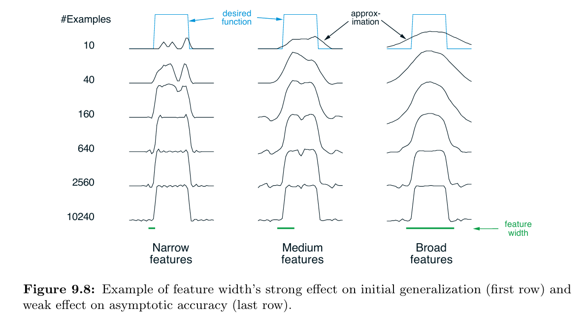

# Coarse Coding: Square Wave Function Approximation

This repository explores the impact of receptive field size (feature width) in coarse coding for approximating discontinuous functions. The implementation follows Figure 9.8 from Chapter 9 of *Reinforcement Learning: An Introduction* (2nd Edition) by Sutton & Barto.

---

## Project Structure

```
square-wave/
├── src/
│   ├── classes.py              # Core classes: Interval, ValueFunction
│   └── square_wave.py          # Square wave function and training logic
├── notebooks/
│   └── square_wave.ipynb       # Jupyter notebook for running experiments
├── book_images/
│   └── Figure_9_8.PNG          # Reference figure from the textbook
├── generated_images/
│   └── figure_9_8.png          # Output from our simulation
└── README.md                   # Project documentation
```

---

## Objective

The experiment demonstrates how **feature width** affects the ability of a linear function approximator to learn a **1D square wave**:

```
f(x) = { 1,  if 0.5 < x < 1.5
       { 0,  otherwise
```

Using coarse coding with ~50 overlapping features, we train three models with different feature widths:

- **Narrow (0.2)**: Fine resolution, localized learning
- **Medium (0.4)**: Balanced generalization
- **Broad (1.0)**: Wide overlap, aggressive smoothing

---

## Implementation Details

### Training Process

- **Domain**: [0, 2)
- **Samples**: Uniformly random points from the domain
- **Step-size parameter**: α = 0.2 / n (where n = number of active features)
- **Learning rule**: Semi-gradient descent

---

## Results

### Reference (Sutton & Barto)



### Our Simulation


---

## Key Observations

**Narrow Features:**
+ Learning is slow and generalizes poorly. The function is learned only at sampled points, leaving rough gaps elsewhere.

**Medium Features:**
+ Offers the best trade-off. It generalizes well enough to capture the square wave’s structure while preserving sharp transitions.

**Broad Features:**
+ Enables rapid early learning due to wide overlap but produces an overly smooth approximation, failing to model discontinuities.
---

## Running the Experiment

### Prerequisites

```bash
pip install numpy matplotlib
```

### Execute Notebook

```bash
jupyter notebook notebooks/square_wave.ipynb
```

## Learning Outcomes

This experiment illustrates fundamental principles of function approximation:

1. **Generalization vs. Discrimination**: Wider features spread learning but lose detail
2. **Sample Efficiency**: Broad features learn faster early but plateau sooner
3. **Feature Design**: Proper receptive field sizing is crucial for RL systems
4. **Bias-Variance Trade-off**: Visible through the three width comparisons

The square wave's discontinuity makes it an excellent test case for revealing these trade-offs.