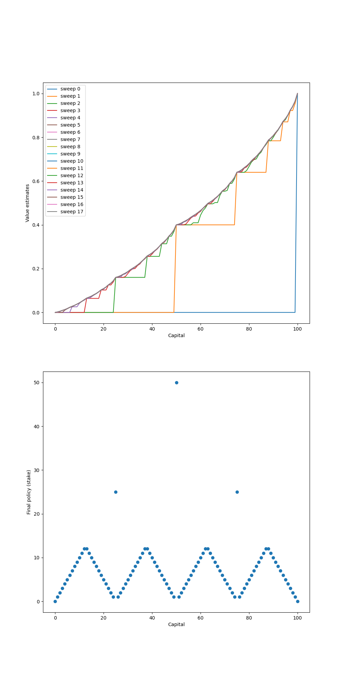

# **Reinforcement Learning: Gambler’s Problem**

This project implements solutions to the **Gambler’s Problem**, based on **Chapter 4: Dynamic Programming** from the book **Reinforcement Learning: An Introduction** by **Richard S. Sutton & Andrew G. Barto**.


---

## **📂 Project Structure**
```
gambler-problem/
│── src/                       # Core implementation
│   ├── __init__.py            
│   ├── gambler.py             # Gambler's problem DP logic
│── notebooks/                 # Jupyter Notebooks for experimentation
│   ├── gambler_problem.ipynb  
│── book_images/               # Reference images from the book
│   ├── Figure_4_3.PNG         # Figure from Sutton's book
│── generated_images/          # Plots generated from simulations
│   ├── figure_4_3.png         # Generated plot from gambler problem
│── README.md                  # Project documentation
```


---

## 📌 Key Features  
✅ Implements **Dynamic Programming** for solving the **Gambler’s Problem**.  
✅ Visualizes the **value function** and **policy iteration process**.  
✅ Simulates different **betting strategies** and their outcomes.  
✅ Clean separation between **logic and experiments** using notebooks.  
✅ Great for building foundational understanding of **RL and DP**.

---

## 📊 Results and Visualizations

### 1️⃣ Figure 4.3 from Sutton's Book  
This figure demonstrates the policy iteration results for the Gambler’s Problem, as shown in Sutton’s book.

📈 **Visualization:**


_This image is taken directly from the book to illustrate the gambler’s problem setup._

---

### 2️⃣ Generated Simulation Results  
These are visualizations of simulation results for different strategies applied to the gambler’s problem.

📈 **Visualization:**



_This plot shows the results generated from the gambler’s problem using dynamic programming._

---

## 📢 Conclusion

This project explores **Dynamic Programming techniques** applied to the **Gambler’s Problem**:

- **Policy iteration** for optimizing the gambler’s strategy.  
- Exploration of **betting strategies** using DP methods.  
- A step toward understanding **model-based reinforcement learning**.

Through these techniques, we gain insights into **decision-making under uncertainty** and **optimal policies** for simple games.

---
