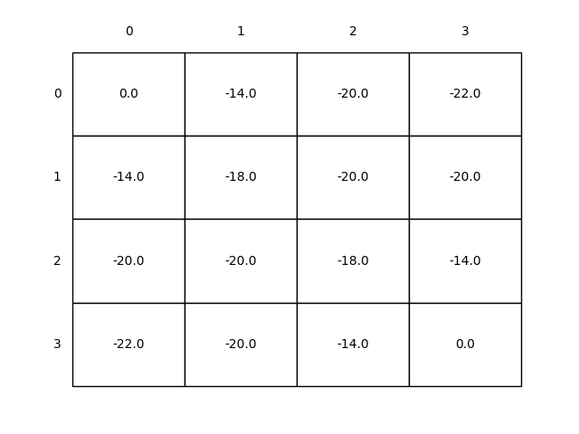

# Reinforcement Learning: Gridworld DP
This project demonstrates **Dynamic Programming** methods in **Reinforcement Learning** using a simple 4x4 Gridworld environment. It covers **Policy Evaluation (Prediction)**, **Policy Improvement**, and **Policy Iteration**.

---

## Project Structure

```text
gridworld-dp/
├── src/                            # Core implementation
│   ├── __init__.py
│   └── grid_world.py               # Gridworld DP logic
├── notebooks/                      # Jupyter Notebooks for experimentation
│   └── grid_world.ipynb
├── book_images/                    # Reference images from the book
│   ├── Example_4_1.PNG             # Policy iteration example (book version)
│   └── Figure_4_1.PNG              # Gridworld configuration and value function example
├── generated_images/               # Plots generated from simulations
│   ├── figure_4_1_in_place.png     # In-place policy evaluation results
│   └── figure_4_1_out_place.png    # Out-of-place policy evaluation results
└── README.md                       # Project documentation
```

---

## Gridworld Description

- The environment is a **4x4 grid** with terminal states at the top-left `(0, 0)` and bottom-right `(3, 3)`.
- All other states are **non-terminal**.
- There are **4 possible actions**: `left`, `up`, `right`, `down`. Actions that would take the agent off the grid leave the state unchanged.
- The **reward** is `-1` on all transitions until a terminal state is reached.
- The task is **episodic** and **undiscounted** (discount factor `γ = 1`).
- The agent initially follows an **equiprobable random policy**, where all actions are equally likely.

---

## Policy Evaluation (Prediction)

**Objective:** Compute the **state-value function** v_π(s) for a given policy π using iterative updates.

- The iterative updates are computed using the **Bellman expectation equation**:

```text
v_π(s) = Σ_a π(a|s) Σ_{s',r} p(s', r | s, a) [r + γ v_π(s')]
```

- The final state-values represent the **negation of the expected number of steps** from each state until termination.

### Example Output

- **In-place computation:** updates values immediately in the same array.
  

- **Out-of-place computation:** updates values in a new array.
  

> In-place: 113 iterations  
> Out-of-place: 172 iterations

---

## Policy Improvement

- A **greedy policy** is generated with respect to the computed value function v_π.
- Any new policy generated using this method is **guaranteed to be an improvement** over the original policy.
- Multiple actions may achieve the maximum value in some states; any probability distribution over these actions is allowed.

**Observation:** In this Gridworld, the new greedy policy is often **optimal after just one improvement**.

---

## Policy Iteration

- Policy iteration alternates between **policy evaluation** and **policy improvement** until convergence.
- In this Gridworld, **policy iteration converges very quickly**, often in a single iteration, finding the **optimal policy** that reaches terminal states in the minimum number of steps.

---

## References

Sutton, R. S., & Barto, A. G. (2018). Reinforcement Learning: An Introduction (2nd Edition), Chapters 4.

Figure 4.1: Convergence of iterative policy evaluation on a small gridworld.