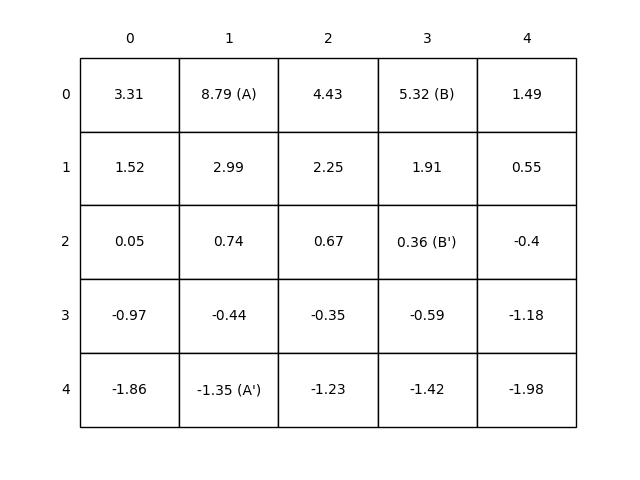
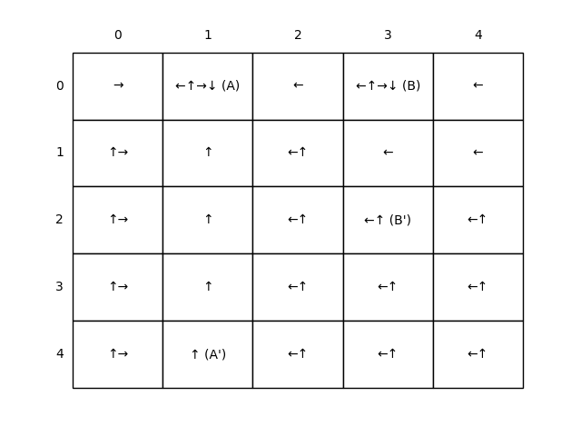
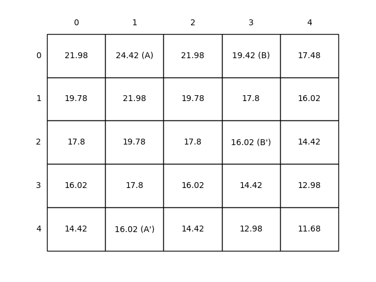

# Grid World Environment

This project implements a **Grid World** environment, a classic problem setup in reinforcement learning.  
The environment contains special states, rewards, and actions, and supports visualization of both the **state-value function** and the **policy**.

---

## 📖 Project Overview

- The grid world is a **5x5 environment**.
- Two special states exist:
  - **State A (0,1)** → transitions to **A′ (4,1)** with reward **+10**.
  - **State B (0,3)** → transitions to **B′ (2,3)** with reward **+5**.
- Standard actions: **Left (←), Up (↑), Right (→), Down (↓)**.
- Moving outside the grid gives a penalty of **-1** and keeps the agent in place.
- Otherwise, rewards are **0**.

---

## ⚙️ Key Functions

- **`step(state, action)`**  
  Handles the agent’s transition from a given state when taking an action. Returns:
  - Next state
  - Immediate reward

- **`draw(grid, is_policy=False)`**  
  Visualizes the environment either as:
  - A **state-value grid** (when `is_policy=False`).
  - A **policy grid** showing the best action(s) per state (when `is_policy=True`).

---

## 📊 Results & Figures

### Figure 3.2 — State Value Function
  
Shows the **expected returns** under a random policy. Higher values appear near **A** and **B**, since they give large rewards.


---

### Figure 3.5 (Policy) — Optimal Policy
Displays the **optimal policy** with arrows for best actions. The strategy guides the agent toward **A** and **B** to maximize rewards.

  

---

### Figure 3.5 — Convergence of State Values
Plots the **value estimates** over iterations, flattening as they converge to stable values.

  

---

## 🚀 How to Run

1. Install dependencies:
   ```bash
   pip install numpy matplotlib
