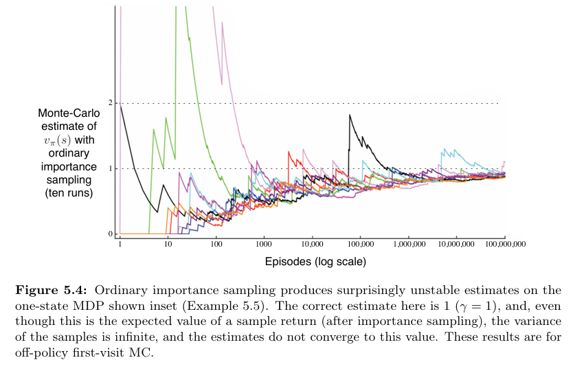
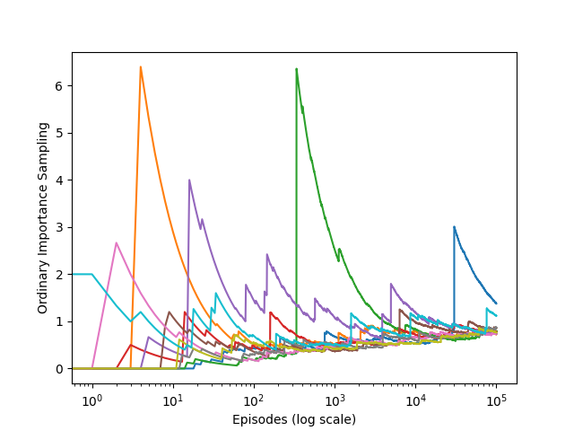

# Reinforcement Learning: Infinite Variance

This project explores the phenomenon of infinite variance in Monte Carlo off-policy evaluation using importance sampling, based on Chapter 5: Monte Carlo Methods from *Reinforcement Learning: An Introduction* by Richard S. Sutton & Andrew G. Barto.

## Project Structure

```
infinite-variance/
│── src/                            # Core simulation code
│   ├── infinite_variance.py
│── notebooks/                      # Jupyter Notebook for experiments
│   ├── infinite_variance.ipynb
│── book_images/                    # Figures from Sutton & Barto
│   ├── Figure_5_4_1.PNG
│   ├── Figure_5_4_2.PNG
│── generated_images/              # Generated result plots
│   ├── figure_5_4.png
│── README.md                      # Project documentation
```

## Overview

This implementation demonstrates a critical failure mode in reinforcement learning where importance sampling estimators become theoretically unbiased but practically unusable due to infinite variance. The simulation replicates the conditions described in Sutton & Barto's textbook to illustrate why ordinary importance sampling can be problematic in off-policy evaluation.

## Key Features

- Simulates off-policy evaluation via importance sampling
- Uses a custom environment designed to produce rare target trajectories
- Implements distinct target and behavior policies with significant divergence
- Demonstrates how importance ratios can explode in long episodes
- Provides visual comparisons between book figures and simulation results

## Environment Description

The environment is specifically designed to highlight the variance problem in importance sampling:

**Action Space**: Two actions - left (0) and right (1)

**Policy Definitions**:
- **Target Policy**: Deterministically selects left action
- **Behavior Policy**: Uniformly random selection between left and right (50% probability each)

**Reward Structure**:
- Selecting right: Episode terminates immediately with reward = 0
- Selecting left: Episode continues with 90% probability, otherwise terminates with reward = 1

This structure ensures that episodes following the target policy become exponentially unlikely under the behavior policy as episode length increases, leading to massive importance weights during evaluation.

## Mathematical Foundation

The importance sampling estimator attempts to evaluate the target policy using trajectories generated by the behavior policy. The importance ratio for a trajectory τ is:

```
ρ(τ) = π_target(τ) / π_behavior(τ)
```

In this environment, trajectories that consist entirely of left actions have:
- High probability under the target policy: π_target(τ) = 1
- Exponentially decreasing probability under the behavior policy: π_behavior(τ) = (0.5)^T

This leads to importance ratios that grow exponentially with trajectory length T.

## Results and Analysis

### Reference Figures from Sutton & Barto

The following figures from the textbook illustrate the theoretical problem:




### Simulation Results

The generated simulation output replicates these conditions:



## Interpretation

The results demonstrate several key points about importance sampling:

**Unbiased but Unstable**: The estimator is mathematically correct in expectation but exhibits extreme variability in individual estimates.

**Exponential Variance Growth**: Most episodes terminate early due to random right selections, while rare episodes that follow the target policy produce disproportionately large importance weights.

**Sample Inefficiency**: Additional samples do not reduce the variance, as the fundamental problem lies in the exponential divergence between policies.

**Practical Implications**: These characteristics make ordinary importance sampling unsuitable for many real-world applications despite its theoretical soundness.

## Key Insights

This experiment illustrates why practitioners often prefer alternative approaches:

- **Weighted Importance Sampling**: Reduces variance at the cost of introducing bias
- **Control Variates**: Use auxiliary information to reduce variance
- **Clipped Importance Sampling**: Truncate extreme weights to improve stability
- **Off-policy Actor-Critic Methods**: Combine policy evaluation with bootstrapping


## Conclusion

This project demonstrates a fundamental limitation in off-policy reinforcement learning where theoretically sound methods can fail catastrophically in practice. The infinite variance problem in importance sampling serves as a cautionary example of the gap between mathematical theory and practical implementation, highlighting the need for robust algorithmic design in reinforcement learning systems.

The simulation provides concrete evidence for why the field has developed more sophisticated off-policy evaluation techniques and reinforces the importance of understanding when and why basic methods may break down.