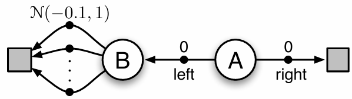
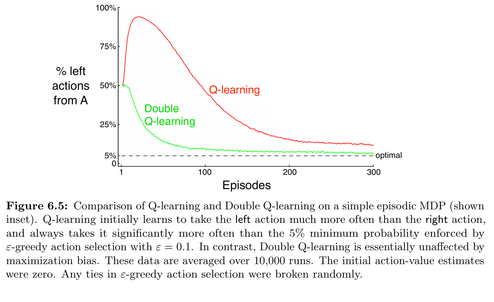
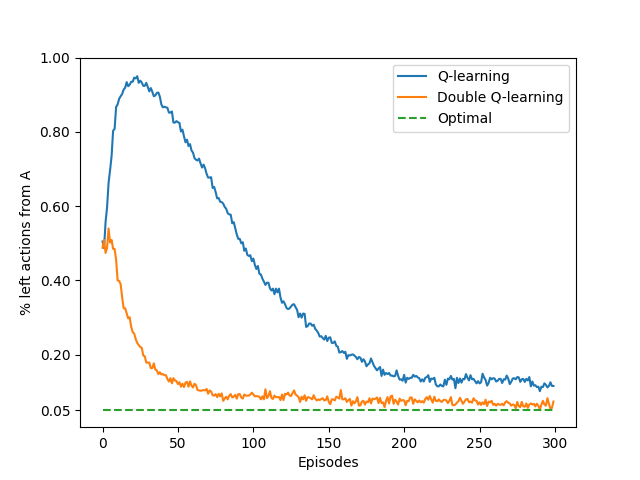

# **Exploring Maximization Bias in Reinforcement Learning**

This repository demonstrates the **maximization bias** phenomenon in temporal-difference learning methods by comparing **Q-learning** with **Double Q-learning** algorithms. The implementation is inspired by **Example 6.5** from *Reinforcement Learning: An Introduction* by **Sutton & Barto** (Chapter 6).

---

## **Repository Layout**

```
maximization-bias/
├── src/                          # Implementation files
│   └── maximization_bias.py      # Q-learning & Double Q-learning algorithms
├── notebooks/                    # Interactive analysis
│   └── maximization_bias.ipynb
├── book_images/                  # Reference materials from textbook
│   ├── Figure_6_5_graph.PNG
│   └── Figure_6_5_mdp.PNG
├── generated_images/             # Experimental results
│   └── figure_6_5.png
└── README.md                     # Documentation
```

---

## **What This Project Does**

+ **Compares** standard Q-learning against Double Q-learning
+ **Illustrates** how value overestimation affects decision-making
+ **Recreates** the classic maximization bias experiment
+ **Analyzes** action selection patterns in a controlled environment
+ **Generates** performance comparisons matching Sutton's findings

---

## **Experimental Environment**

The testbed uses a **minimal MDP** designed to expose maximization bias:

**State Space**:

- `A` (initial state)
- `B` (transition state)  
- `terminal` (final state)

**Available Actions**:
- In state `A`: choose `right` (direct path to terminal) or `left` (path through B)
- In state `B`: ten equivalent actions, all transitioning to terminal

**Reward Structure**:
- Transitions from `A`: reward = **0**
- Transitions from `B`: reward ~ **N(-0.1, 1.0)** (normally distributed)

---

## **Algorithm Comparison**

### Standard Q-learning
- Traditional **temporal-difference** value learning
- Uses **max operator** for bootstrapping next-state values
- Prone to **systematic overestimation** due to maximization bias

### Double Q-learning  
- Employs **dual value function** estimation (Q₁ and Q₂)
- **Alternates** between updating each function
- **Separates** action selection from value evaluation to reduce bias

---

## **Experimental Results**

### **Reference Material from Textbook**
Original figures demonstrating the theoretical framework:

**Environment Structure:**



**Expected Behavior:**



---

### **Simulation Outcomes**
Our implementation produces these experimental findings:

**Algorithm Performance Comparison:**



The plot demonstrates that **Q-learning exhibits strong bias toward the "left" action** in state A, while **Double Q-learning maintains near-optimal behavior**.

---

## **Key Insights**

- **Standard Q-learning** systematically overestimates values, creating preference for suboptimal paths
- **Double Q-learning** successfully mitigates overestimation through its dual-estimator approach  
- The bias becomes apparent even in simple environments with stochastic rewards
- **Unbiased estimation** is crucial for learning optimal policies in reinforcement learning

---

## **Learning Outcomes**

This implementation serves as a practical exploration of:

- **Value overestimation** challenges in temporal-difference methods
- **Double Q-learning** as a solution to maximization bias
- **Experimental validation** of theoretical RL concepts from Sutton & Barto

Understanding maximization bias is fundamental for grasping why **sophisticated value estimation techniques** are necessary in modern reinforcement learning applications.