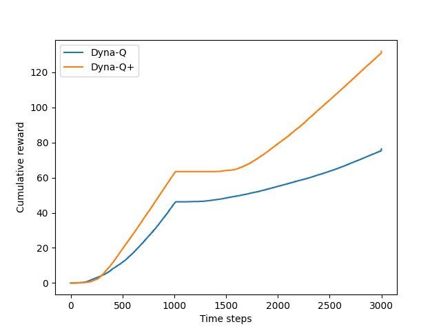
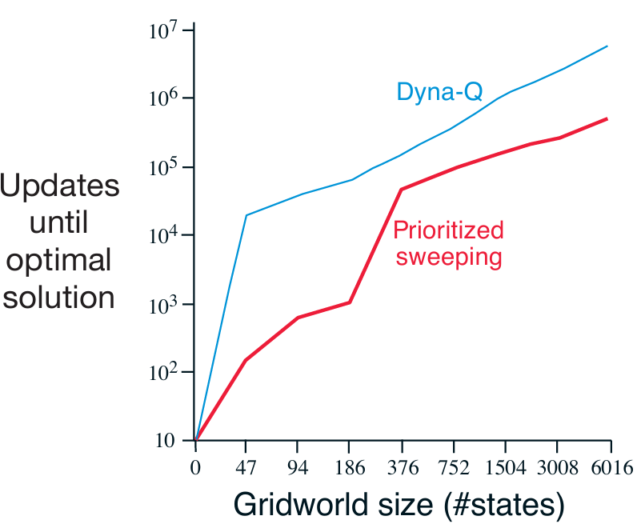

# Reinforcement Learning: Tabular Model-Based Methods for Maze Navigation

This project implements and evaluates several tabular model-based reinforcement learning algorithms, including Dyna-Q, Dyna-Q+, and Prioritized Sweeping. The implementations are based on Chapter 8: Planning and Learning with Tabular Methods from *Reinforcement Learning: An Introduction* by Richard S. Sutton and Andrew G. Barto.

---

## Project Structure

```
mazes/
├── src/
│   ├── dyna.py           # DynaParams class with algorithm parameters
│   ├── functions.py      # Core algorithm implementations (Dyna-Q, Dyna-Q+, Prioritized Sweeping)
│   ├── maze.py           # Maze environment definition and state transitions
│   └── models.py         # Tabular models for planning (TrivialModel, TimeModel, PriorityModel)
│
├── notebooks/
│   ├── dyna_maze.ipynb              # Dyna-Q experiments and analysis
│   ├── changing_maze.ipynb          # Dyna-Q+ experiments with changing environments
│   └── prioritized_sweeping.ipynb   # Prioritized Sweeping experiments
│
├── book_images/          # Reference figures from Sutton & Barto textbook
├── generated_images/     # Experimental results and plots
└── README.md
```

---

## Overview

The project demonstrates how integrating planning with learning can dramatically accelerate convergence to optimal policies in grid-world environments. Three main algorithms are implemented:

### Dyna-Q
A model-based reinforcement learning architecture that combines:
- **Direct RL:** Q-Learning updates from real experience
- **Model Learning:** Stores observed transitions (S, A, R, S') in a tabular model
- **Planning:** Performs simulated updates by sampling from the learned model

### Dyna-Q+
An extension of Dyna-Q designed for non-stationary environments. It encourages exploration of state-action pairs that have not been visited recently by adding a bonus reward:

R' = R + κ√τ

where τ is the time elapsed since (S, A) was last tried and κ is a small exploration constant.

### Prioritized Sweeping
An efficient planning method that focuses computational resources on state-action pairs with high TD error:
- Maintains a priority queue based on absolute TD error
- Updates predecessors when a state's value changes
- Propagates value information backward through the state space more efficiently

---

## Environment

The maze environment is a 2D grid world with the following characteristics:

- Default size: 6x9 grid (54 states)
- Actions: UP, DOWN, LEFT, RIGHT
- Deterministic transitions (blocked by walls and obstacles)
- Reward structure: +1 for reaching goal, 0 otherwise
- Episodes terminate upon reaching the goal state
- Discount factor (γ): 0.95
- Exploration rate (ε): 0.1

The environment can be extended to higher resolutions for scalability experiments.

---

## Experiments and Results

### 1. Dyna Maze (Standard Learning)

This experiment demonstrates the impact of planning steps on learning speed. Three configurations are compared:
- n=0 (pure Q-Learning, no planning)
- n=5 (5 planning steps per real step)
- n=50 (50 planning steps per real step)

**Book Reference:**


**Experimental Results:**


**Key Findings:**
- The n=0 agent requires approximately 25 episodes to reach optimal performance
- The n=5 agent reaches optimal performance in about 5 episodes
- The n=50 agent achieves optimal performance in just 3 episodes
- Planning dramatically accelerates learning by propagating value information throughout the model

---

### 2. Blocking Maze (Environment Degradation)

This experiment tests agent adaptation when the environment becomes worse. After 1000 steps, the optimal path is blocked and a longer alternative path opens.

**Book Reference:**


**Experimental Results:**


**Key Findings:**
- Both agents initially learn the short path
- When the environment changes, both experience a period of no reward (flat line)
- Agents eventually discover the new path through exploration
- Dyna-Q+ recovers more quickly due to its exploration bonus mechanism

---

### 3. Shortcut Maze (Environment Improvement)

This experiment examines agent behavior when the environment improves. After 3000 steps, a shorter path opens while the original path remains available.

**Book Reference:**


**Experimental Results:**


**Key Findings:**
- Standard Dyna-Q fails to discover the shortcut
- The agent's model indicates no shortcut exists, so planning reinforces the old path
- Dyna-Q+ successfully discovers and exploits the shortcut due to its exploration bonus
- Demonstrates the exploration-exploitation tradeoff in planning contexts

---

### 4. Prioritized Sweeping (Computational Efficiency)

This experiment compares the computational efficiency of Prioritized Sweeping against standard Dyna-Q across mazes of increasing resolution.

**Book Reference:**


**Experimental Results:**


**Key Findings:**
- Prioritized Sweeping requires 5-10x fewer backups to find optimal solutions
- The advantage increases with maze complexity
- Focusing updates on high-priority states is significantly more efficient than uniform sampling
- Critical for scaling to larger state spaces

---

## Algorithm Implementation Details

### Action Selection
All algorithms use ε-greedy action selection:
- With probability ε: select a random action
- With probability 1-ε: select the action with highest Q-value (breaking ties randomly)

### Q-Learning Update Rule
Q(S,A) ← Q(S,A) + α[R + γ max Q(S',a) - Q(S,A)]

where:
- α is the step-size parameter (learning rate)
- γ is the discount factor
- R is the immediate reward
- S' is the next state

### Model Structure
- **TrivialModel:** Simple dictionary storing (S,A) → (S',R) mappings
- **TimeModel:** Extends TrivialModel by tracking elapsed time for each state-action pair
- **PriorityModel:** Extends TrivialModel with priority queue and predecessor tracking

---

## Key Parameters

```python
class DynaParams:
    discount = 0.95                    # γ: reward discount factor
    exploration_probability = 0.1      # ε: exploration rate
    step_size = 0.1                    # α: learning rate
    time_weight = 1e-4                # κ: exploration bonus coefficient (Dyna-Q+)
    planning_steps = 5                 # n: planning steps per real step
    threshold = 0.0001                 # θ: priority queue threshold (Prioritized Sweeping)
    runs = 10                          # number of independent runs for averaging
```

---

## Theoretical Background

### The Planning-Learning Spectrum
These algorithms illustrate the integration of two fundamental approaches:
- **Learning:** Improving behavior based on real experience
- **Planning:** Improving behavior by reasoning about a model

### Model Errors and Adaptation
Models can be incorrect due to:
1. Environmental stochasticity with limited samples
2. Function approximation generalization errors
3. Environmental changes

When models are optimistic (predict better outcomes than reality), errors are discovered quickly. When environments improve without revealing it, exploration mechanisms like Dyna-Q+ are essential.

### Computational Considerations
- **Planning steps:** More planning steps accelerate learning but increase computation per real step
- **Priority-based planning:** Focuses computation where it matters most
- **Exploration bonuses:** Add computational cost but prevent premature convergence

---

## Conclusions

This project demonstrates several fundamental principles of model-based reinforcement learning:

1. **Integration Benefits:** Combining learning and planning significantly accelerates convergence compared to pure RL methods

2. **Model Utility:** Even simple tabular models with a few planning steps provide substantial performance improvements

3. **Adaptation Requirements:** Non-stationary environments require explicit exploration mechanisms beyond standard ε-greedy policies

4. **Computational Efficiency:** Prioritizing updates based on TD error provides order-of-magnitude improvements in sample efficiency

5. **Exploration-Exploitation Tradeoff:** In planning contexts, exploration means improving the model while exploitation means using the current model optimally

These results provide foundational insights into the design of more sophisticated model-based RL algorithms applicable to complex, real-world problems.

---

## References

Sutton, R. S., & Barto, A. G. (2018). *Reinforcement Learning: An Introduction* (2nd ed.). MIT Press. Chapter 8: Planning and Learning with Tabular Methods.