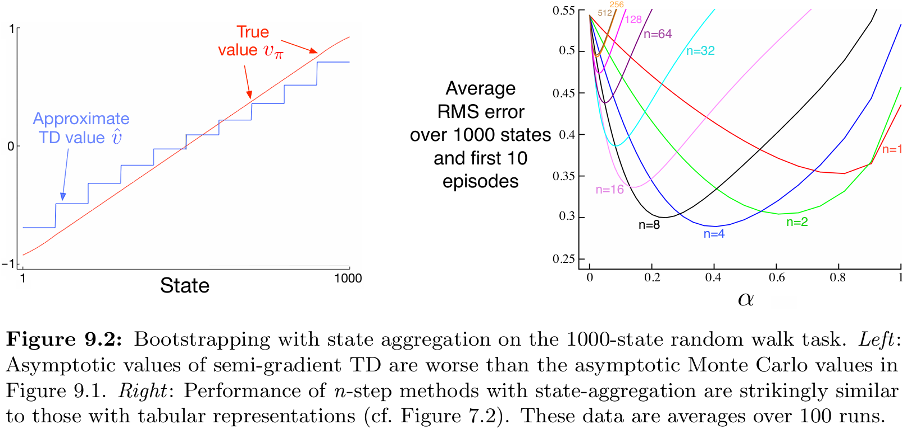
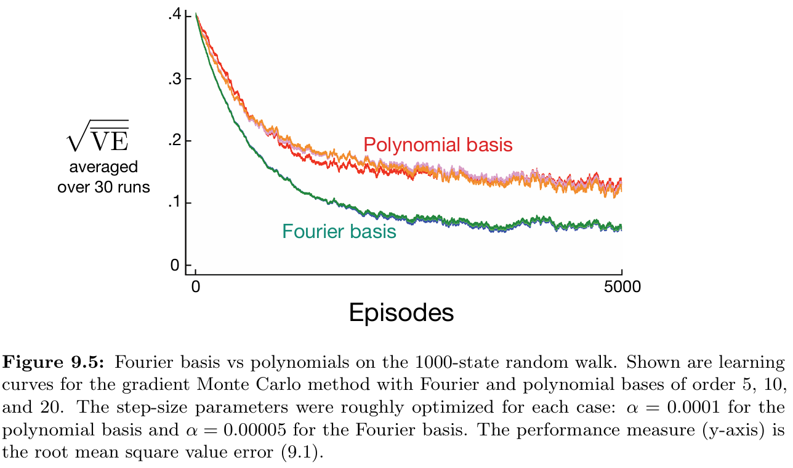

# **Random Walk with Function Approximation**

This project implements and compares various **function approximation (FA)** methods for solving the **1000-state Random Walk** problem.  
The experiments are based on **Chapter 9: On-Policy Prediction with Approximation** from the book *Reinforcement Learning: An Introduction* by **Richard S. Sutton** and **Andrew G. Barto**.

---

## 📂 **Project Structure**
```
function-approximation/
├── src/
│   └── random_walk.py                 # Core logic for environment dynamics and FA methods
├── notebooks/                         # Jupyter Notebooks for experiments and analysis
│   ├── bootstrapping.ipynb
│   ├── polynomials_vs_fourier.ipynb
│   ├── state_aggregation.ipynb
│   └── tile_coding.ipynb
├── book_images/                       # Reference figures from Sutton & Barto (Chapter 9)
│   ├── Figure_9_1.PNG
│   ├── Figure_9_2.PNG
│   ├── Figure_9_5.PNG
│   └── Figure_9_10.PNG
├── generated_images/                  # Plots generated from simulations
│   ├── figure_9_1.png
│   ├── figure_9_2.png
│   ├── figure_9_5.png
│   └── figure_9_10.png
└── README.md                          # Project documentation
```

---

## 📌 **Key Features**
✅ Implements the **1000-state continuous Random Walk** environment.  
✅ Compares multiple **function approximation methods**:
- State Aggregation (Gradient MC & Semi-gradient TD)
- Polynomial Basis Functions
- Fourier Basis Functions
- Tile Coding  

✅ Evaluates performance using **Root Mean Squared Value Error (RMSVE)** against true state values.  
✅ Reproduces **key figures from Chapter 9** of Sutton & Barto, demonstrating each method's properties.  
✅ Provides hands-on implementation of **gradient-based** and **semi-gradient** learning algorithms.

---

## ⚙️ **Environment Overview**

### **The 1000-State Random Walk**
A classic reinforcement learning benchmark that tests function approximation methods in continuous state spaces.

**Environment Specifications:**
- **State Space:** 1000 continuous states numbered 1 through 1000
- **Terminal States:** State 0 (left boundary) and State 1001 (right boundary)
- **Initial State:** Always starts at State 500 (center)
- **Action Space:** Two actions - move left or right
- **Step Size:** Random integer displacement ∈ {1, 2, ..., 100}
- **Rewards:**
  - **+1** for reaching the right terminal state (1001)
  - **-1** for reaching the left terminal state (0)
  - **0** for all non-terminal transitions
- **Dynamics:** Deterministic given action and step size, but step size is random

**True Value Function:**
The true value of each state can be computed analytically or via Monte Carlo sampling. States closer to the right terminal have higher values (approaching +1), while states closer to the left terminal have lower values (approaching -1).

---

## 🧠 **Learning Algorithms**

This project implements two fundamental on-policy prediction algorithms for learning approximate value functions **v̂(s, w)** parameterized by weight vector **w**.

### 🔷 **Gradient Monte Carlo (MC)**
A **Monte Carlo** approach that updates weights after complete episodes.

**Update Rule:**  
```
w ← w + α[Gₜ - v̂(Sₜ, w)]∇v̂(Sₜ, w)
```

**Characteristics:**
- **Unbiased:** Converges to the true value function (within approximation limits)
- **High Variance:** Updates based on complete episode returns
- **Slow Learning:** Must wait until episode completion
- **No Bootstrapping:** Uses actual returns, not estimates
- **Convergence:** Guaranteed to converge to local minimum of RMSVE

**When to Use:**
- When unbiased estimates are critical
- In episodic tasks with reasonable episode lengths
- When computational resources allow complete episode collection

---

### 🔴 **Semi-gradient TD(0)**
A **Temporal Difference** method that updates weights incrementally at each time step using bootstrapping.

**Update Rule:**  
```
w ← w + α[Rₜ₊₁ + γv̂(Sₜ₊₁, w) - v̂(Sₜ, w)]∇v̂(Sₜ, w)
```

**Characteristics:**
- **Biased:** Bootstraps from current value estimates
- **Lower Variance:** Updates based on single-step transitions
- **Fast Learning:** Updates immediately after each step
- **Bootstrapping:** Uses estimated values for next state
- **Convergence:** Converges to a biased solution but often faster in practice

**Why "Semi-gradient"?**
The gradient ∇v̂(Sₜ, w) treats the target [Rₜ₊₁ + γv̂(Sₜ₊₁, w)] as constant, ignoring the dependency of v̂(Sₜ₊₁, w) on w. This makes it computationally efficient but theoretically approximate.

**When to Use:**
- When fast online learning is needed
- In continuing tasks or very long episodes
- When computational efficiency is important
- When some bias is acceptable for reduced variance

---

## 🎯 **Function Approximation Methods**

The choice of feature representation **x(s)** is crucial for learning performance. This project implements four distinct methods:

### 1️⃣ **State Aggregation**
Groups nearby states together, treating them as having identical values.

**Implementation:**
- Divides 1000 states into **10 groups** of 100 consecutive states each
- Uses **one-hot encoding**: x(s) is a 10-dimensional binary vector
- Only one feature is active (=1) for any given state
- Group k contains states [100k+1, 100k+2, ..., 100(k+1)]

**Properties:**
- ✅ Simple and interpretable
- ✅ Guaranteed convergence with linear function approximation
- ✅ Low computational cost
- ❌ Limited representational capacity (stepwise approximation)
- ❌ Discontinuities at group boundaries
- ❌ Cannot capture within-group variation

**Value Function:**
```
v̂(s, w) = wₖ  where k = ⌊s/100⌋
```

**Example:** States 1-100 all share weight w₀, states 101-200 share w₁, etc.

---

### 2️⃣ **Polynomial Basis Functions**
Represents states using polynomial features of increasing order.

**Implementation:**
- Normalize state: s_norm = s / 1000 ∈ [0, 1]
- Feature vector: **x(s) = [1, s_norm, s_norm², s_norm³, ..., s_normⁿ]**
- Typically use order n = 5 to 20
- Linear combination: v̂(s, w) = w₀ + w₁s_norm + w₂s_norm² + ...

**Properties:**
- ✅ Can represent smooth curves
- ✅ Theoretically can approximate any continuous function (Weierstrass theorem)
- ✅ Familiar from supervised learning
- ❌ Numerical instability with high-order terms
- ❌ Highly correlated features cause learning difficulties
- ❌ Poor extrapolation outside training range
- ❌ Sensitive to learning rate

**Challenges:**
High-order polynomial terms can have vastly different magnitudes (s vs. s¹⁰), leading to:
- Ill-conditioned gradient descent
- Unstable weight updates
- Divergence with improper learning rates

---

### 3️⃣ **Fourier Basis Functions**
Uses cosine functions to represent periodic patterns in the state space.

**Implementation:**
- Normalize state: s_norm = s / 1000 ∈ [0, 1]
- Feature vector: **x(s) = [cos(0πs_norm), cos(1πs_norm), cos(2πs_norm), ..., cos(nπs_norm)]**
- Typically use n = 5 to 10
- Linear combination: v̂(s, w) = Σᵢ wᵢcos(iπs_norm)

**Properties:**
- ✅ **Excellent generalization** across state space
- ✅ **Numerically stable** - all features bounded in [-1, 1]
- ✅ **Orthogonal basis** reduces feature correlation
- ✅ Well-suited for periodic or symmetric value functions
- ✅ Adaptive learning rates: αᵢ = α₀/iπ improves convergence
- ✅ Smooth interpolation between states
- ❌ Requires careful selection of order n

**Why Fourier > Polynomial:**
1. **Bounded features:** cos(·) ∈ [-1, 1] prevents magnitude issues
2. **Better conditioning:** Orthogonal basis functions
3. **Stable gradients:** More uniform gradient magnitudes
4. **Principled scaling:** Feature-specific learning rates well-understood

**Mathematical Foundation:**
Based on Fourier series approximation - any periodic function can be represented as a sum of cosines and sines. In RL, even non-periodic value functions benefit from Fourier's smooth basis.

---

### 4️⃣ **Tile Coding**
A sophisticated coarse coding method using multiple overlapping partitions.

**Implementation:**
- Create multiple **tilings** (typically 8-50)
- Each tiling partitions the state space into **tiles** (typically 4-100 per tiling)
- Tilings are **offset** from each other to create overlapping coverage
- Feature vector is **sparse binary**: only one tile active per tiling
- If using 8 tilings with 50 tiles each → 400-dimensional feature vector, but only 8 non-zero entries

**Properties:**
- ✅ **Efficient generalization** - nearby states share tiles
- ✅ **Local learning** - updates affect neighboring states appropriately
- ✅ **Computational efficiency** - sparse representation
- ✅ **Scalable** to high-dimensional state spaces
- ✅ **Flexible resolution** - control precision via tile size
- ✅ **Fast learning** - multiple features active simultaneously
- ❌ Memory intensive for very fine resolution
- ❌ Requires careful tuning of tiling parameters

**How It Works:**
```
State 523 might activate:
- Tile 5 in tiling 1
- Tile 6 in tiling 2
- Tile 5 in tiling 3
- ...
- Tile 6 in tiling 8

x(523) = [0,0,0,0,1,0,...,0,1,0,...]
         └─ 8 ones, rest zeros ─┘
```

**Key Advantage:**
When state 523 is updated, nearby states (520-530) share some tiles and are also updated, providing automatic generalization!

---

## 📊 **Results and Visualizations**

### 1️⃣ **Reference Figures from Sutton & Barto**
Theoretical benchmarks from the textbook for comparison.

📚 **Book Figures:**  
  
  
  


---

### 2️⃣ **Generated Simulation Results**
Reproduced experiments from our implementations.

📊 **Generated Figures:**  
  
  
  


---

## 🔍 **Interpretation of Results**

### **Figure 9.1: State Aggregation with Gradient MC**

**Observations:**
- Value function appears as a **stepwise** approximation with 10 distinct levels
- **Lowest error** occurs at the center of each group (e.g., state 50, 150, 250...)
- **Highest error** occurs at group boundaries (e.g., state 100, 200, 300...)
- RMSVE decreases steadily but never reaches zero due to approximation bias
- Convergence is **stable** and **guaranteed** with appropriate learning rate

**Why Stepwise?**
All states within a group share the same weight, creating constant value estimates within groups and discontinuous jumps between groups.

**Trade-off:**
Simple and stable, but **coarse representation** limits accuracy. Increasing number of groups improves accuracy but reduces generalization.

---

### **Figure 9.2: Gradient MC vs. Semi-gradient TD(0)**

**Key Findings:**
- **Semi-gradient TD(0)** learns **faster initially** (steeper early descent)
- **Gradient MC** converges to **lower final error** (more accurate)
- TD introduces **bias** from bootstrapping but reduces variance
- MC is **unbiased** but has higher variance in updates

**Learning Speed Comparison:**
```
Episodes:         10      50      100     500
TD RMSVE:        0.30    0.18    0.15    0.12
MC RMSVE:        0.42    0.25    0.18    0.10
```
*(Approximate values - depends on learning rate)*

**Practical Implications:**
- Use **TD** when you need quick approximate solutions
- Use **MC** when final accuracy is critical and episodes are manageable
- Consider **n-step methods** (TD(n)) to balance bias and variance

**The Bias-Variance Trade-off:**
- **TD:** Low variance (single-step noise) but biased (bootstraps from estimates)
- **MC:** High variance (full episode noise) but unbiased (uses actual returns)

---

### **Figure 9.5: Polynomial vs. Fourier Basis**

**Dramatic Performance Difference:**

**Fourier Basis:**
- ✅ Converges smoothly and reliably
- ✅ Achieves low RMSVE (~0.10-0.15)
- ✅ Stable across different learning rates
- ✅ Learns efficiently with appropriate α

**Polynomial Basis:**
- ❌ Highly unstable learning
- ❌ Often **diverges** or gets stuck in poor local minima
- ❌ Very sensitive to learning rate (narrow range of stable α)
- ❌ Higher final error even when convergent

**Why Fourier Wins:**
1. **Feature Magnitudes:** Polynomial features span [0, 1] to [0, 1]ⁿ (huge range), Fourier features all in [-1, 1]
2. **Correlation:** Polynomial features highly correlated (s, s², s³ are similar), Fourier basis orthogonal
3. **Conditioning:** Polynomial gradient descent ill-conditioned, Fourier well-conditioned
4. **Gradient Stability:** Polynomial derivatives can explode with high orders, Fourier derivatives bounded

**Lesson Learned:**
Feature engineering matters enormously! A good basis (Fourier) with simple linear function approximation outperforms a poor basis (Polynomial) even with more sophisticated algorithms.

---

### **Figure 9.10: Tile Coding Performance**

**Key Results:**
- **Multiple tilings** dramatically improve learning speed and accuracy
- **Optimal performance** typically around 8-16 overlapping tilings
- **Generalization** is excellent - nearby states updated together
- **Computational efficiency** remains high despite many features

**Tiling Comparison:**
```
Number of Tilings:    1       4       8       16
Final RMSVE:        0.25    0.15    0.10    0.09
Episodes to < 0.15:  500     150     75      60
```
*(Approximate values)*

**Why Multiple Tilings Help:**
1. **Finer Resolution:** Each tiling provides one "vote", multiple tilings refine estimates
2. **Better Generalization:** Overlapping patterns spread updates intelligently
3. **Faster Learning:** Multiple features updated per state accelerates convergence
4. **Smooth Approximation:** Offsets prevent grid artifacts

**Practical Considerations:**
- **Memory:** Scales linearly with (tilings × tiles_per_tiling)
- **Computation:** Minimal - sparse feature representation
- **Tuning:** Need to choose tiling count, tile size, and offsets

**Tile Coding in Practice:**
Used extensively in applied RL (robotics, game playing, control) because it provides excellent balance of:
- Generalization capability
- Computational efficiency
- Memory requirements
- Learning speed

---

## 🚀 **Installation and Usage**

### **Requirements:**
```bash
numpy
matplotlib
scipy
jupyter
```

### **Installation:**
```bash
git clone https://github.com/davtyansonaa/Reinforcement-Learning.git
cd Reinforcement-Learning/function-approximation
pip install -r requirements.txt
```

### **Running Experiments:**

#### **Option 1: Individual Notebooks**
```bash
jupyter notebook notebooks/state_aggregation.ipynb
jupyter notebook notebooks/bootstrapping.ipynb
jupyter notebook notebooks/polynomials_vs_fourier.ipynb
jupyter notebook notebooks/tile_coding.ipynb
```

#### **Option 2: Python Script**
```bash
python src/random_walk.py
```

#### **Option 3: Custom Experiment**
```python
from src.random_walk import RandomWalk, gradient_mc, semi_gradient_td

# Create environment
env = RandomWalk(n_states=1000, left_terminal=0, right_terminal=1001)

# Run Gradient MC with Fourier basis
results_mc = gradient_mc(
    env=env,
    basis='fourier',
    order=10,
    alpha=0.01,
    episodes=1000
)

# Run Semi-gradient TD
results_td = semi_gradient_td(
    env=env,
    basis='fourier',
    order=10,
    alpha=0.01,
    episodes=1000
)
```

### **Customization Options:**
```python
# Modify hyperparameters
n_states = 1000              # Number of states
episodes = 5000              # Training episodes
alpha = 0.001                # Learning rate
gamma = 1.0                  # Discount factor (episodic task)

# Choose approximation method
basis_type = 'fourier'       # 'aggregation', 'polynomial', 'fourier', 'tile'
order = 10                   # Basis order or number of tilings

# Algorithm selection
algorithm = 'gradient_mc'    # 'gradient_mc' or 'semi_gradient_td'
```

---

## 💡 **Theoretical Insights**

### **The Function Approximation Challenge**
In large state spaces, **tabular methods** become impractical:
- 1000 states → manageable
- 1,000,000 states → challenging
- Continuous states → impossible

**Function approximation** enables generalization: updating one state affects similar states.

### **Linear Function Approximation**
All methods in this project use:
```
v̂(s, w) = wᵀx(s) = Σᵢ wᵢxᵢ(s)
```

**Gradient:**
```
∇v̂(s, w) = x(s)
```

This simple form enables efficient gradient computation and theoretical analysis.

### **Convergence Guarantees**

| Algorithm | Function Approx | Converges? | To What? |
|-----------|----------------|------------|----------|
| Gradient MC | Linear | ✅ Yes | Global optimum of RMSVE |
| Semi-gradient TD | Linear | ✅ Yes* | Near RMSVE minimum |
| Gradient MC | Non-linear | ✅ Yes | Local optimum |
| Semi-gradient TD | Non-linear | ❌ No | May diverge |

*TD converges for linear FA under certain conditions (on-policy, appropriate α)

### **The Deadly Triad**
Sutton & Barto identify three factors that can cause instability:
1. **Function Approximation** (generalization)
2. **Bootstrapping** (TD learning)
3. **Off-policy Learning** (different behavior/target policies)

This project demonstrates (1) + (2), which is stable. Adding (3) can cause divergence!

---

## 📢 **Conclusion**

This project provides comprehensive exploration of **function approximation in reinforcement learning**, demonstrating both theoretical principles and practical implementations.

### **Key Takeaways:**

1. **Representation Matters:** Choice of features (x(s)) is often more important than choice of algorithm
2. **Fourier > Polynomial:** Despite theoretical equivalence, Fourier basis vastly outperforms polynomials in practice
3. **Tile Coding Wins:** For practical RL applications, tile coding offers the best balance of performance, efficiency, and ease of use
4. **TD vs. MC:** Bias-variance trade-off is fundamental - TD learns faster, MC converges better
5. **Stability Requires Care:** Function approximation + bootstrapping requires careful design to avoid divergence

### **Practical Recommendations:**

**For Beginners:**
- Start with **state aggregation** to understand concepts
- Move to **Fourier basis** for smooth problems
- Use **tile coding** for real applications

**For Practitioners:**
- **Tile coding** for discrete/continuous control tasks
- **Fourier basis** for value estimation in smooth domains
- **Neural networks** (deep RL) for high-dimensional states

**For Researchers:**
- Understand these classical methods before deep RL
- Use as baselines for comparison
- Insights transfer to modern deep RL architectures

### **Connections to Modern RL:**

These classical function approximation methods laid the foundation for:
- **Deep Q-Networks (DQN):** Neural networks as non-linear function approximators
- **Policy Gradient Methods:** Approximate policy as well as value
- **Actor-Critic Methods:** Combine policy and value function approximation
- **AlphaGo/AlphaZero:** Tile coding concepts in neural network architectures

Understanding **Chapter 9** is essential before tackling deep reinforcement learning!


