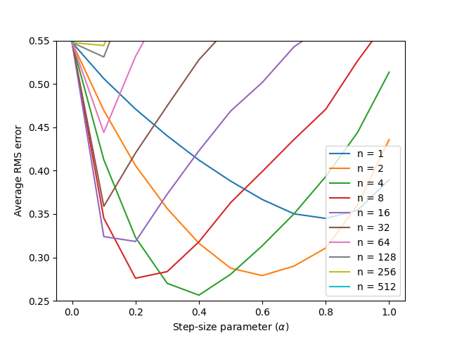

# n-Step Temporal Difference Learning on the Random Walk

This repository explores **n-step Temporal Difference (TD) methods** in a simple **Random Walk** environment.  
It follows the experiment described in **Example 7.2 (Chapter 7: n-Step Bootstrapping)** of *Reinforcement Learning: An Introduction* by **Sutton and Barto**, demonstrating how varying the number of update steps influences learning performance.

---

## Project Layout

```
random-walk-ntd/  
├── src/
│   └── random_walk.py          # Implementation of the n-step TD algorithm
├── notebooks/
│   └── random_walk.ipynb       # Jupyter notebook running the main experiment
├── book_images/                # Reference figures from the textbook
│   ├── Example_6_2_top.PNG
│   └── Figure_7_2.PNG
├── generated_images/
│   └── figure_7_2.png          # Output plot from the simulation
└── README.md                   # Project documentation
```

---

## Environment Description

The environment is a **1-dimensional random walk** consisting of **19 non-terminal states** plus two terminal states.

- **States:** `0` (left terminal), `1–19` (non-terminal), `20` (right terminal)  
- **Starting point:** Always begins in the middle (state 10)  
- **Actions:** Move **left** or **right** with equal probability (0.5 each)  
- **Rewards:**
  - Moving into **state 0** → reward **−1**  
  - Moving into **state 20** → reward **+1**  
  - All other transitions → reward **0**

The **true state values** form a linear ramp between −1 and +1:

```
V(s) = [−0.9, −0.8, …, +0.8, +0.9]
```

---

## Algorithm Overview

The **n-step TD prediction algorithm** bridges the gap between **TD(0)** (one-step bootstrapping) and **Monte Carlo** (full-episode updates).

For a given step size **α**, discount factor **γ**, and step count **n**, the update is:

```
G_t = R_{t+1} + γR_{t+2} + ... + γ^(n−1)R_{t+n} + γ^n V(S_{t+n})
V(S_t) ← V(S_t) + α[G_t − V(S_t)]
```

**Key characteristics:**
- `n = 1` → TD(0)
- `n → ∞` → Monte Carlo
- Intermediate `n` values balance **bias** (from bootstrapping) and **variance** (from sampling)

---

**Performance metric:**  
Root Mean Squared (RMS) error between estimated and true state values, averaged across all states and runs.

The experiment reproduces the trend shown in Sutton & Barto's **Figure 7.2**, comparing performance across different `n` and learning rates.

---

## Results

Generated figure (`generated_images/figure_7_2.png`):

<p align="center">
  
</p>

**Observations:**
- **Small n:** Faster learning but higher bias  
- **Large n:** Lower bias but higher variance  
- **Intermediate n:** Achieves the best balance — minimizing RMS error over early episodes

---

## Takeaways

- n-step TD methods **unify** TD and Monte Carlo through a tunable step length  
- There exists an **optimal intermediate n** that achieves both stability and efficiency  
- This experiment provides a practical view of the **bias-variance trade-off** in reinforcement learning

---

## Requirements

Install dependencies:
```bash
pip install numpy matplotlib tqdm
```

Run the notebook:
```bash
jupyter notebook notebooks/random_walk.ipynb
```


