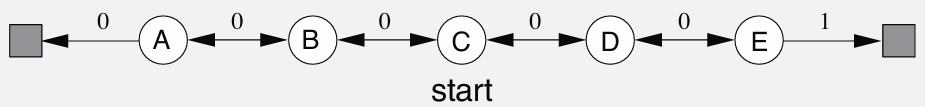

# Temporal-Difference vs Monte Carlo: Random Walk Analysis

This project demonstrates the implementation of **Monte Carlo (MC)** and **Temporal-Difference (TD(0))** learning algorithms applied to the classic **Random Walk** problem, featured as **Example 6.2** in *Reinforcement Learning: An Introduction* by **Richard S. Sutton** and **Andrew G. Barto**.

The objective is to explore and compare how these two fundamental learning approaches estimate value functions when operating under equivalent training scenarios.

---

## Project Organization

```
random_walk/
├── src/                    # Implementation of Random Walk environment and algorithms
│   └── random_walk.py
├── notebooks/              # Interactive Jupyter notebook for experiments
│   └── random_walk.ipynb
├── book_images/            # Original reference figures from Sutton & Barto
│   ├── Example_6_2_top.PNG
│   ├── Example_6_2_bottom.PNG
│   └── Figure_6_2.PNG
├── generated_images/       # Generated visualization outputs
│   ├── example_6_2.png
│   └── figure_6_2.png
└── README.md              # Project documentation
```

---

## Environment Overview

- A **one-dimensional grid world** consisting of 7 states:
    - Terminal states: State 0 (leftmost), State 6 (rightmost)
    - Non-terminal states: States 1–5 (corresponding to positions A–E)
- The agent begins each episode at the center position (State 3 / C) and takes random steps left or right with 0.5 probability each.
- Episodes terminate upon reaching either boundary:
    - Left boundary (State 0) → Reward = 0
    - Right boundary (State 6) → Reward = 1

**Analytical state values**:
```
V(A)=1/6, V(B)=2/6, V(C)=3/6, V(D)=4/6, V(E)=5/6
```

---

## Algorithm Implementations

### Monte Carlo (MC) Method
- Performs value updates exclusively at episode completion.
- Utilizes the complete discounted return from each trajectory.
- Update rule:
 ``` V(S) ← V(S) + α * (G - V(S))```

### Temporal-Difference Learning (TD(0))
- Executes real-time updates throughout episodes using single-step predictions.
- Leverages bootstrapping with estimated values of successor states.
- Update rule:
  ```V(S) ← V(S) + α * (R + V(S') - V(S))```

### Batch Processing Mode
- Accumulates training episodes and performs iterative updates until value convergence.
- Both MC and TD(0) algorithms are evaluated under **batch conditions**, demonstrating how identical datasets can lead to distinct solution paths.

---

## Experimental Results and Analysis

### Reference Materials
Original illustrations from the Sutton & Barto textbook for comparison:





---

### Generated Results
Experimental outcomes produced by the implemented learning algorithms:


These visualizations illustrate the root mean squared error (RMSE) progression of value predictions and the temporal evolution of state value estimates throughout the learning process.

---

## Primary Observations

- **TD(0)** demonstrates accelerated learning through bootstrapping mechanisms, though it introduces systematic bias.
- **Monte Carlo** provides statistically unbiased estimates at the cost of increased variance.
- When operating in batch mode, the algorithms converge to **distinct solutions** from identical training data, exemplifying the fundamental bias-variance tradeoff.
- Experimental results closely match the original Figure 6.2 from Sutton's work, confirming implementation accuracy.

---

## Summary

This implementation provides a comprehensive comparison between **Monte Carlo** and **TD(0)** learning methodologies within a controlled environment:

- Illustrates the temporal dynamics of value function learning
- Demonstrates convergence patterns under batch learning conditions  
- Reinforces fundamental concepts including bootstrapping and the bias-variance relationship

The Random Walk environment serves as an excellent pedagogical tool for understanding **model-free reinforcement learning** principles and value function approximation techniques.

---