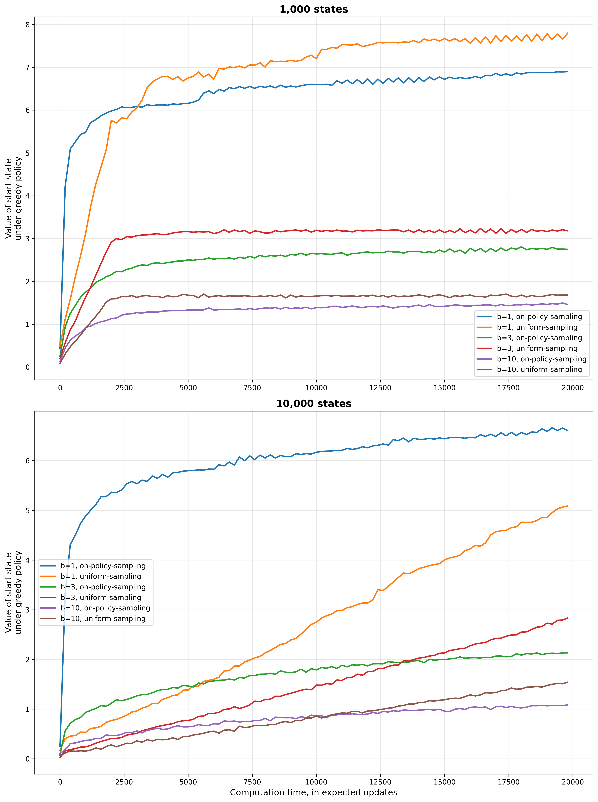

# **Reinforcement Learning: Trajectory Sampling**

This project provides a comparative analysis of **uniform sampling** and **on-policy sampling** distributions in model-based reinforcement learning planning.  
The experiment is based on **Chapter 8: Planning and Learning with Tabular Methods**, specifically **Figure 8.8**, from the book *Reinforcement Learning: An Introduction* by **Richard S. Sutton** and **Andrew G. Barto**.

---

## 📂 **Project Structure**
```
trajectory-sampling/
├── src/
│   ├── __init__.py                    # Package initialization
│   └── trajectory_sampling.py         # Core implementation of sampling distribution comparison
├── notebooks/
│   └── trajectory_sampling.ipynb      # Notebook for running and visualizing experiments
├── .idea/                             # IDE configuration files
├── book_images/                       # Reference figures from Sutton & Barto
├── generated_images/
│   └── figure_8_8.png                 # Reproduced figure from simulation results
└── README.md                          # Project documentation
```

---

## 📌 **Key Features**
✅ Compares **uniform sampling** vs. **on-policy sampling** for planning updates.  
✅ Analyzes the impact of **state-action distribution** on learning performance.  
✅ Tests multiple **branching factors** (b = 1, 3, 10) across different state space sizes.  
✅ Reproduces **Figure 8.8** from Sutton & Barto's textbook.  
✅ Demonstrates the efficiency of **on-policy trajectory sampling** in model-based planning.  
✅ Implements **parallel processing** for faster experimentation.

---

## ⚙️ **Experiment Overview**
The experiment investigates a fundamental question in model-based planning:

> *Which state-action pairs should we update? Should we sample uniformly across all pairs, or should we focus on pairs that are likely to be encountered under the current policy?*

### **Key Parameters:**
- **Number of States:** 1,000 and 10,000 states
- **Branching Factor (b):** 1, 3, and 10 possible next states per state-action pair
- **Termination Probability:** 0.1 (10% chance of episode termination on any transition)
- **Maximum Updates:** 20,000 expected updates
- **Exploration (ε):** 0.1 for ε-greedy policy in on-policy sampling
- **Tasks per Configuration:** 30 independent tasks averaged
- **Evaluation Points:** 100 checkpoints throughout training

### **Performance Metric:**
The **value of the start state under the greedy policy**, evaluated using Monte Carlo rollouts (1,000 runs per evaluation).

---

## 🧠 **Sampling Distributions**

### 🔷 **Uniform Sampling**
Updates state-action pairs in a systematic, round-robin fashion across the entire state-action space.

**Characteristics:**
- **Distribution:** All state-action pairs updated with equal probability
- **Coverage:** Comprehensive exploration of the entire state-action space
- **Efficiency:** May waste computation on irrelevant states
- **Implementation:** Cycles through states and actions sequentially

**Update Pattern:**
```
For step = 0, 1, 2, ...
    state = (step // |A|) % |S|
    action = step % |A|
    Perform expected update on (state, action)
```

**Advantages:**
- ✅ Systematic coverage of all states
- ✅ No bias toward specific regions
- ✅ Deterministic update pattern

**Disadvantages:**
- ❌ Updates many irrelevant state-action pairs
- ❌ Ignores policy structure
- ❌ Less efficient in large state spaces

---

### 🔴 **On-Policy Sampling**
Focuses updates on state-action pairs likely to be encountered by following the current policy (with ε-greedy exploration).

**Characteristics:**
- **Distribution:** Samples according to the trajectory distribution of the current policy
- **Coverage:** Concentrates on policy-relevant states
- **Efficiency:** Focuses computation where it matters most
- **Implementation:** Simulates policy execution to select states

**Update Pattern:**
```
state = start_state
For step = 0, 1, 2, ...
    With probability ε: action = random
    Otherwise: action = argmax Q(state, ·)
    
    Perform expected update on (state, action)
    state = next_state from simulated transition
    
    If terminal: state = start_state
```

**Advantages:**
- ✅ Focuses on relevant state-action pairs
- ✅ Faster convergence to good policies
- ✅ More efficient use of computation
- ✅ Adapts as policy improves

**Disadvantages:**
- ❌ May miss important states initially
- ❌ Depends on exploration parameter (ε)
- ❌ Less coverage of state space

---

## 🔬 **Implementation Details**

### **Task Environment**
The experiment uses randomly generated MDPs with the following structure:

```python
class Task:
    def __init__(self, n_states, branching_factor):
        # Random transitions: for each (state, action), 
        # branching_factor possible next states
        self.transition = np.random.randint(
            n_states, 
            size=(n_states, n_actions, branching_factor)
        )
        
        # Random rewards: Gaussian distribution
        self.reward = np.random.randn(
            n_states, 
            n_actions, 
            branching_factor
        )
        
        # 10% chance of episode termination
        self.termination_probability = 0.1
```

### **Expected Update Formula**
Both methods perform **expected updates** (not sample updates):

```python
# For a given state-action pair (s, a):
Q(s, a) ← (1 - p_term) × mean[R(s,a,s') + max_a' Q(s', a')]
```

where the mean is taken over all `branching_factor` possible next states.

### **Evaluation Process**
After every `eval_interval` updates:
1. Extract greedy policy: π(s) = argmax_a Q(s, a)
2. Run 1,000 Monte Carlo episodes from start state
3. Record average cumulative reward

---

## 📊 **Experimental Results**

### **Configuration Matrix:**
| States | Branching Factors | Methods | Total Configurations |
|--------|------------------|---------|---------------------|
| 1,000  | 1, 3, 10         | 2       | 6                   |
| 10,000 | 1, 3, 10         | 2       | 6                   |

### **Generated Results:**
The figure shows how the value of the start state improves as more expected updates are performed.

📊 **Reproduced Figure 8.8:**  


### **Key Observations:**

#### **1,000 States (Top Panel):**
- **b = 1:** Both methods perform similarly since there's no branching advantage
- **On-policy sampling (b=1)** shows the fastest initial convergence (blue line)
- **Uniform sampling (b=1)** follows closely (orange line) 
- **Higher branching factors (b=3, b=10):** Performance degrades for both methods, but on-policy sampling maintains advantage
- **Uniform sampling** wastes computation on irrelevant states as branching increases

#### **10,000 States (Bottom Panel):**
- **Dramatic difference** in performance between sampling strategies
- **On-policy sampling (b=1)** achieves highest value ~6.5 (blue line)
- **Uniform sampling (b=1)** struggles to improve beyond ~5.0 (orange line)
- **Larger state space** amplifies the disadvantage of uniform sampling
- **On-policy sampling** efficiently focuses on reachable states
- **Uniform sampling** spreads updates too thin across 10,000 states

---

## 🔍 **Interpretation of Results**

### **Main Findings:**

1. **On-Policy Sampling Wins:** For all configurations, on-policy sampling achieves better or equal performance compared to uniform sampling, especially in large state spaces.

2. **State Space Size Matters:** The advantage of on-policy sampling becomes more pronounced as the state space grows from 1,000 to 10,000 states.

3. **Branching Factor Impact:** Higher branching factors (b=10) reduce performance for both methods, but on-policy sampling maintains its relative advantage.

4. **Computation Efficiency:** On-policy sampling focuses updates on states that matter, making it more sample-efficient than uniform coverage.

5. **Convergence Speed:** On-policy sampling shows steeper initial improvement, reaching good policies faster.

### **Why On-Policy Sampling Works Better:**

#### **Focused Computation:**
- In a 10,000-state MDP, many states may be **unreachable** from the start state
- Uniform sampling wastes updates on states that will never be visited
- On-policy sampling naturally focuses on the **reachable state space**

#### **Policy-Guided Updates:**
- As the policy improves, on-policy sampling follows better trajectories
- Creates a **positive feedback loop**: better policy → better updates → better policy
- Uniform sampling doesn't benefit from policy improvements

#### **Effective State Coverage:**
```
Uniform Sampling:     On-Policy Sampling:
All states (10,000)   Reachable states (~100-1,000)
   ↓                      ↓
Thin coverage          Dense coverage
Slow learning          Fast learning
```

---

## 🚀 **Installation and Usage**

### **Installation:**
```bash
git clone https://github.com/davtyansonaa/Reinforcement-Learning.git
cd Reinforcement-Learning/trajectory-sampling
pip install -r requirements.txt
```

### **Running the Experiment:**

#### **Option 1: Python Script**
```bash
python src/trajectory_sampling.py
```

#### **Option 2: Jupyter Notebook**
```bash
jupyter notebook notebooks/trajectory_sampling.ipynb
```

#### **Option 3: Custom Configuration**
```python
from src.trajectory_sampling import run_experiment, uniform_sampling, on_policy_sampling

# Define parameters
n_states = 1000
branching_factor = 3
methods = [on_policy_sampling, uniform_sampling]

# Run experiment
results = run_experiment(
    n_states=n_states,
    branching_factor=branching_factor,
    methods=methods,
    n_tasks=30,
    evaluation_points=100
)
```

### **Customization Options:**
Modify hyperparameters in `src/trajectory_sampling.py`:
```python
# Experiment parameters
max_steps = 20000              # Total number of updates
termination_probability = 0.1  # Episode termination chance
exploration_probability = 0.1  # ε for ε-greedy policy

# Experiment scale
num_states = [1000, 10000]     # State space sizes
branch_factors = [1, 3, 10]    # Branching factors
n_tasks = 30                   # Tasks to average over
```

---

## ⚡ **Performance Optimizations**

The implementation includes several optimizations for faster execution:

### **1. Pre-computed Transitions and Rewards**
```python
# Generate all transitions upfront (no repeated random generation)
self.transition = np.random.randint(n_states, size=(n_states, 2, b))
self.reward = np.random.randn(n_states, 2, b)
```

### **2. Vectorized Expected Updates**
```python
# Vectorized computation over all branching_factor next states
next_value_estimates = np.max(estimates[next_states], axis=1)
estimates[state, action] = (1 - p_term) * np.mean(rewards + next_value_estimates)
```

### **3. Parallel Processing**
```python
# Run multiple tasks in parallel using all CPU cores
with ProcessPoolExecutor(max_workers=mp.cpu_count()) as executor:
    results = list(executor.map(run_single_task, args_list))
```

### **4. Pre-allocated Arrays**
```python
# Pre-compute random decisions to avoid repeated RNG calls
self.termination_mask = np.random.rand(max_steps) < termination_probability
self.random_choices = np.random.randint(branching_factor, size=max_steps)
```

**Speed Improvement:** These optimizations reduce runtime by ~10-20x compared to naive implementations.

---

## 💡 **Theoretical Background**

### **The Distribution Mismatch Problem**
In planning, we want to improve the policy by updating state-action values. But which updates help most?

**Uniform Distribution:**
```
P_uniform(s, a) = 1 / (|S| × |A|)
```
Every state-action pair equally likely.

**On-Policy Distribution:**
```
P_π(s, a) = d_π(s) × π(a|s)
```
where d_π(s) is the state visitation frequency under policy π.

### **Why Distribution Matters**
Consider a 10,000-state MDP where only 200 states are reachable:
- **Uniform sampling:** Spends 98% of updates on unreachable states
- **On-policy sampling:** Focuses 100% of updates on reachable states

### **Connection to Dyna Architecture**
This experiment relates to the **Dyna** framework:
- **Dyna-Q:** Uses uniform sampling (tabular sweep)
- **Prioritized Sweeping:** Focuses on important state-action pairs
- **On-policy Dyna:** Our on-policy sampling approach

The results suggest that **prioritized or on-policy sampling** is more efficient than uniform sweeps.

---

## 📢 **Conclusion**

This project demonstrates that **on-policy trajectory sampling** is more efficient than **uniform sampling** for model-based planning, especially in large state spaces.

### **Key Takeaways:**
- ✅ **On-policy sampling focuses computation** on states that matter
- ✅ **Performance advantage grows** with state space size
- ✅ **Branching factor** affects both methods, but on-policy sampling remains superior
- ✅ **Practical implications:** Use policy-guided sampling in Dyna-style algorithms
- ✅ **Trade-off:** Focused updates vs. comprehensive coverage

### **Practical Applications:**
1. **Model-based RL:** Prioritize updates along likely trajectories
2. **Planning algorithms:** Focus search on relevant states
3. **Dyna architectures:** Use on-policy distribution for simulated updates
4. **Large MDPs:** Essential for scaling to realistic problems

### **When to Use Each Method:**
- **Uniform Sampling:** When complete coverage is needed, small state spaces, or offline planning with no current policy
- **On-Policy Sampling:** Online planning, large state spaces, when a reasonable policy exists, or computational budget is limited

---


