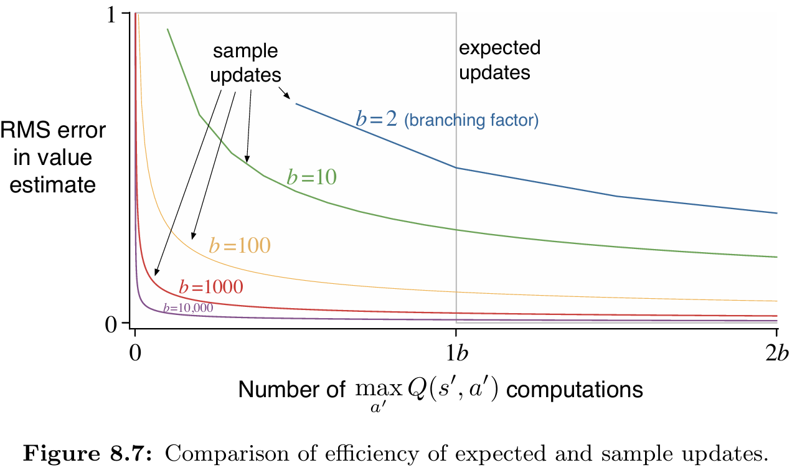

# **Updates Comparison**

This project provides a comparative analysis of **expected updates** and **sample updates** in model-based reinforcement learning.  
The experiment is based on **Chapter 8: Planning and Learning with Tabular Methods**, specifically **Figure 8.7**, from the book *Reinforcement Learning: An Introduction* by **Richard S. Sutton** and **Andrew G. Barto**.

---

## 📂 **Project Structure**
```
updates-comparison/
├── src/
│   └── expectation_vs_sample.py      
├── notebooks/
│   └── expectation_vs_sample.ipynb   
├── book_images/
│   └── Figure_8_7.PNG                
├── generated_images/
│   └── figure_8_7.png                
└── README.md                         
```

---

## 📌 **Key Features**
✅ Compares the computational efficiency of **expected updates** vs. **sample updates**.  
✅ Analyzes the **reduction in RMS error** as a function of computation time and branching factor (*b*).  
✅ Reproduces **Figure 8.7** from Sutton & Barto's textbook.  
✅ Demonstrates why **sample updates** are more practical in large state-action spaces.

---

## ⚙️ **Experiment Overview**
The experiment investigates the fundamental question:

> *Given a fixed amount of computation, is it better to perform a few expensive expected updates or many cheaper sample updates?*

### **Key Parameters:**
- **Branching Factor (b):** Number of possible next states from a given state-action pair.
- **Expected Update:** Computes over all *b* next states — cost proportional to *b*.
- **Sample Update:** Samples one of the *b* next states — cost proportional to *1*.
- **Error Metric:** Root Mean Square (RMS) error between the estimated and true state values.

### **Experimental Setup:**
- Branching factors tested: **b = 2, 10, 100, 1000**
- Number of runs per experiment: **100**
- Updates per run: **2b** (twice the branching factor)
- Next state values: Sampled from a **standard normal distribution**

---

## 🧠 **Update Mechanisms**

### 🔷 **Expected Update**
Computes the value of a state-action pair by considering **all possible next states** and rewards.
- **Cost:** Proportional to the branching factor (*b*)
- **Accuracy:** Eliminates sampling error in a single, computationally expensive step
- **Performance:** After one expected update (cost = *b*), the error ideally drops to zero
- **Limitation:** Represents the **theoretical optimum** but scales poorly with *b*

**Mathematical formulation:**
```
V(s) = Σ p(s'|s,a) × V(s')
```
where the sum is over all *b* possible next states.

---

### 🔴 **Sample Update**
Improves value estimates using **a single sampled transition** from the model.
- **Cost:** Constant (proportional to *1*)
- **Accuracy:** Less accurate per individual update, but many updates can be performed
- **Performance:** The error after *t* sample updates is approximately proportional to **√((b − 1) / (b × t))**
- **Advantage:** Enables frequent, lightweight updates across many states

**Mathematical formulation:**
```
V(s) ← V(s) + α[V(s') - V(s)]
```
where *s'* is a single sampled next state.

---

## 📊 **Implementation Details**

### **Core Algorithm** (`calculate_errors` function)
```python
def calculate_errors(branching_factor):
    # Set the value distribution of the next b states
    distribution = np.random.randn(branching_factor)
    
    # Calculate the true value of the current state
    true_value = np.mean(distribution)
    
    # Simulate sample updates
    samples = []
    errors = []
    
    for _ in range(2 * branching_factor):
        # Sample one next state value
        estimated_value = np.random.choice(distribution)
        samples.append(estimated_value)
        
        # Calculate RMS error
        errors.append(np.abs(np.mean(samples) - true_value))
    
    return errors
```

### **Experiment Execution:**
1. For each branching factor (*b*), run 100 independent trials
2. In each trial, perform *2b* sample updates
3. Track the RMS error after each update
4. Average errors across all runs
5. Plot error vs. computation (normalized by *b*)

---

## 📈 **Results and Visualizations**

### 1️⃣ **Reference Figure from Sutton & Barto**
The original figure from the textbook showing the theoretical comparison of RMS error reduction versus computation time for different branching factors.

📚 **Book Reference:**  


---

### 2️⃣ **Generated Simulation Results**
Reproduced results from our implementation, displaying the average RMS error (over 100 runs) for branching factors of **2**, **10**, **100**, and **1000**.

📊 **Generated Figure:**  


### **Key Observations:**
- **X-axis:** Number of computations (normalized by branching factor *b*)
- **Y-axis:** RMS error in value estimate
- At computation = *b*, expected update would achieve zero error (single expensive update)
- Sample updates show continuous error reduction even with fewer computations than *b*

---

## 🔍 **Interpretation of Results**

### **Main Findings:**
1. **Efficiency of Sample Updates:** For any given computation amount **less than the branching factor (*b*)**, performing that many **sample updates** reduces error much faster than waiting to complete a single expected update.

2. **Scalability:** As *b* increases (e.g., *b = 1000*), even a small portion of the expected update cost allows sample updates to **dramatically reduce error**.

3. **Practical Implications:** This demonstrates that **sample updates** are far more **efficient and scalable** in large environments, where iterating over all transitions is computationally infeasible.

### **Error Decay Analysis:**
- **Expected Update:** Error drops to ~0 after *b* computations (step function)
- **Sample Updates:** Error decreases as **1/√t**, providing continuous improvement
- **Crossover Point:** Sample updates are superior when computation budget < *b*

---

## 🚀 **Installation and Usage**

### **Installation:**
```bash
git clone https://github.com/davtyansonaa/Reinforcement-Learning.git
cd Reinforcement-Learning/updates-comparison
pip install -r requirements.txt
```

### **Running the Experiment:**

**Option 1: Python Script**
```bash
python src/expectation_vs_sample.py
```

**Option 2: Jupyter Notebook**
```bash
jupyter notebook notebooks/expectation_vs_sample.ipynb
```

### **Customization:**
Modify the parameters in the code:
```python
runs = 100  # Number of independent trials
branching_factors = [2, 10, 100, 1000]  # Branching factors to test
```

---

## 💡 **Theoretical Background**

### **Why Sample Updates Work:**
In reinforcement learning, the computational cost of planning algorithms depends heavily on the branching factor. For large state-action spaces:
- **Expected updates** require summing over all possible transitions
- **Sample updates** only require sampling one transition

### **The Trade-off:**
- **Expected updates:** High accuracy per update, but expensive
- **Sample updates:** Lower accuracy per update, but many updates possible for the same cost

### **Mathematical Insight:**
The RMS error after *t* sample updates follows:
```
Error(t) ≈ √((b-1)/(b×t)) × σ
```
where *σ* is the standard deviation of the value distribution.

This shows that sample updates converge at a rate of **1/√t**, while expected updates achieve zero error after exactly *b* computations.

---

## 📢 **Conclusion**

This project replicates and validates the analysis from Sutton & Barto's textbook, confirming that **sample updates** generally outperform **expected updates** when computational resources are limited.

### **Key Takeaways:**
- ✅ **Sample updates are more efficient** for large branching factors
- ✅ **Continuous improvement** vs. all-or-nothing expected updates
- ✅ **Scalability** to real-world problems with massive state spaces
- ✅ **Practical foundation** for modern RL algorithms

While expected updates are theoretically optimal for a single state-action pair with unlimited computation, the **efficiency and generality of sample updates** make them the superior choice for large-scale, real-world reinforcement learning problems.

These findings highlight why **sample-based planning** (e.g., Dyna, Monte Carlo Tree Search) underlies most modern RL algorithms and why methods like Q-learning dominate over exhaustive dynamic programming in practice.

