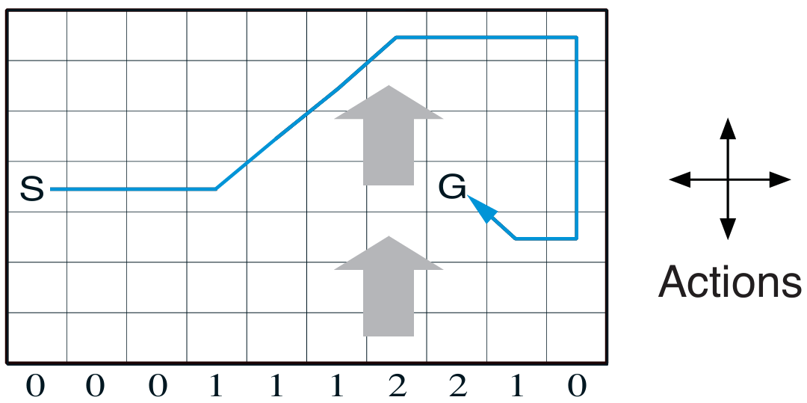

# Reinforcement Learning: Windy Gridworld

This project implements the **SARSA (State-Action-Reward-State-Action)** algorithm to solve the **Windy Gridworld** problem, as presented in *Reinforcement Learning: An Introduction* by Richard S. Sutton and Andrew G. Barto (2nd Edition, Chapter 6, Example 6.5).

## Project Structure

```text
windy-gridworld/
├── src/                            # Core implementation
│   └── windy_grid_world.py         # Windy Gridworld logic and SARSA learning
├── notebooks/                      # Jupyter Notebook for running experiments
│   └── windy_grid_world.ipynb
├── book_images/                    # Reference images from the book
│   ├── Example_6_5_graph.PNG
│   └── Example_6_5_inset.PNG
├── generated_images/               # Plots generated from experiments
│   └── example_6_5.png
└── README.md                       # Project documentation
```

## Key Features

- Implements SARSA for learning action-value estimates
- Uses ε-greedy strategy for action selection
- Models the wind effect on agent transitions
- Tracks number of steps per episode until the goal is reached
- Reproduces Sutton and Barto's Example 6.5 setting with configurable parameters

## Environment Overview

- A 7×10 gridworld with wind affecting vertical movement
- The agent starts at position (3, 0) and must reach the goal at (3, 7)
- Available actions: up, down, left, right
- Wind strength by column:
  ```text
  [0, 0, 0, 1, 1, 1, 2, 2, 1, 0]
  ```
- Each step provides a reward of -1, encouraging the agent to find shorter paths

## Learning Algorithm

**SARSA (On-policy Temporal-Difference Control)**

- Learns action-value estimates Q(s, a) while following an ε-greedy policy
- Updates according to the following rule (Equation 6.7 in the book):
  ```text
  Q(S, A) ← Q(S, A) + α * [R + γ * Q(S', A') − Q(S, A)]
  ```

Parameters used in this implementation:
- Exploration probability (ε): 0.1
- Step size (α): 0.5
- Discount factor (γ): 1.0

## Results and Visualizations

### Reference Figures from Sutton & Barto

Example diagrams from the book for comparison:




### Simulation Results

Generated from the current implementation:


The plot shows the number of time steps per episode. Over time, the agent learns to reach the goal more efficiently.

## Observations

- The agent progressively reduces the number of steps required to reach the goal
- Wind dynamics add complexity and require compensatory actions
- The ε-greedy strategy ensures continued exploration and prevents premature convergence

## Conclusion

This project demonstrates:

- On-policy control using the SARSA algorithm
- How environmental dynamics (wind) influence learning behavior
- Application of Temporal-Difference learning techniques in a gridworld environment

The Windy Gridworld problem highlights the importance of balancing exploration and exploitation while learning effective policies in reinforcement learning.